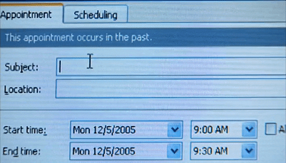

👾 [Inicio](https://rayanepimentel.github.io/InfoSec-iniciante/) | [Comunidades](https://rayanepimentel.github.io/InfoSec-iniciante/site/comunidade/hall.html) | [Técnicas e Ferramentas](https://rayanepimentel.github.io/InfoSec-iniciante/site/ferramentas/ferramentas.html)

# Cronograma 

**Por onde eu comecei?**  
Seguindo conselhos de pessoas que já trabalham na área.

**O que você irá encontrar aqui?**  
Conteúdo gratuito e muita analogia. Eu estudo fazendo analogia, isso me ajuda muito.

## Conteúdo

<h3>Parte I → <a href="https://rayanepimentel.github.io/InfoSec-iniciante/cronograma/bashRedes">Bash e Redes&#x2197;</a></h3>
<h3>Parte II → <a href="https://rayanepimentel.github.io/InfoSec-iniciante/cronograma/web">Web&#x2197;</a></h3>
<h3>Parte III →
    <a href="https://rayanepimentel.github.io/InfoSec-iniciante/OWASP/owasp.html">OWASP&#x2197;</a>
</h3>
<h3>Parte IV →
    <a href="https://rayanepimentel.github.io/InfoSec-iniciante/devSecOps/">DevSecOps&#x2197;</a>
</h3>
<h3>Parte V →
    <a href="https://rayanepimentel.github.io/InfoSec-iniciante/cursos/">Cursos&#x2197;</a>
</h3>
