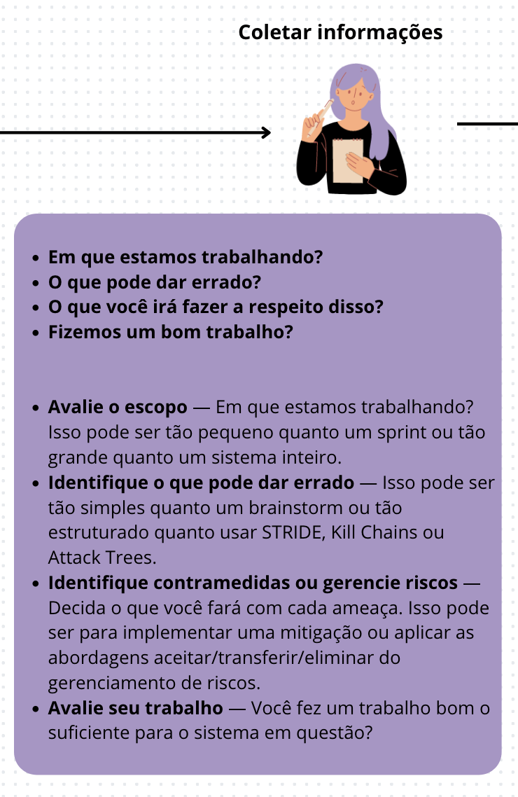
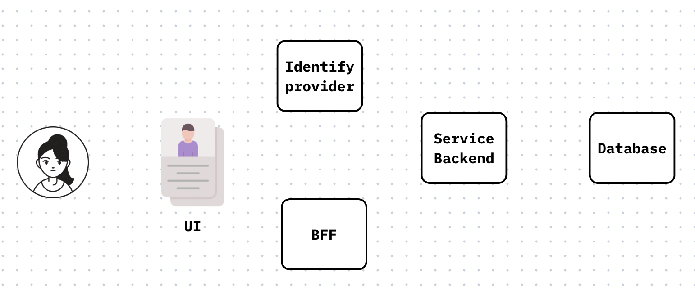
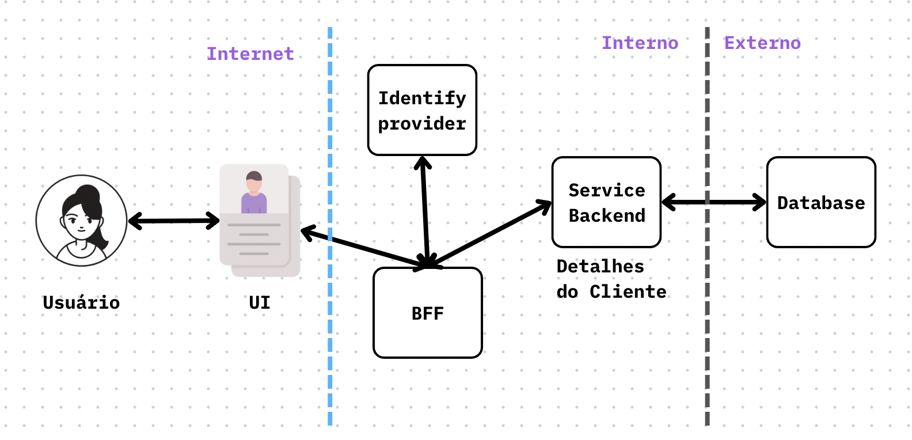
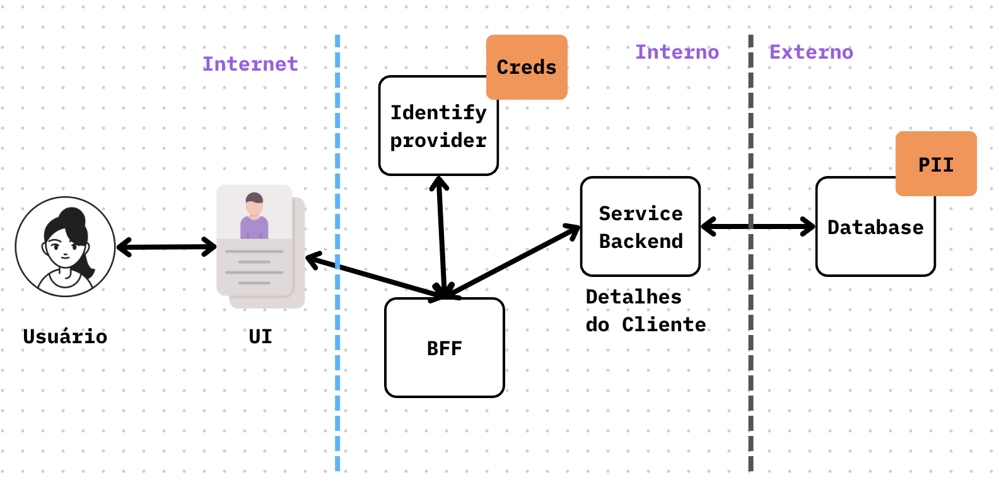

👾 [Inicio](https://rayanepimentel.github.io/InfoSec-iniciante/) | [Cronograma](https://rayanepimentel.github.io/InfoSec-iniciante/cronograma/) | [Cursos](https://rayanepimentel.github.io/InfoSec-iniciante/cursos/) | [Desenvolvimento Seguro](https://rayanepimentel.github.io/InfoSec-iniciante/cursos/desenvolvimento-seguro/)

# Coletar Informações




Para iniciar a modelagem de ameaça, você precisa responder 4 perguntas:

    Em que estamos trabalhando?
    O que pode dar errado?
    O que você irá fazer a respeito disso?
    Fizemos um bom trabalho?


## O que você está construindo?

Antes de começar a pensar em ameaças, riscos e mitigações, precisamos conhecer a aplicação que estamos constuindo.

Digamos que você é um desenvolvedor e foi chamado para participar das reuniões de modelagem de ameaça de uma nova feature.

Primeira coisa que vamos fazer é descobrir o que essa feature faz:

História: 
```
Eu como cliente, preciso de uma página onde possa ver os detalhes da minha conta, para poder confirmar se estão corretos.
```
Agora vamos desenhar o sistema.


**Conhecendo os componentes:**



1. Temos o cliente, que é o usuário da aplicação
2. Interface Frontend (UI): Esta é a camada que o usuário interage para visualizar e editar seu perfil. A pagina web.
3. Backend for Frontend (BFF): Este é o serviço que atua como intermediário entre a interface frontend e os serviços de backend. No nosso caso BFF pode ser responsável por buscar os detalhes do perfil do cliente e preparar esses dados para serem exibidos na interface frontend.
4. Identify provider: Este componente é crucial para garantir que o usuário esteja autenticado antes de acessar a tela de detalhes do perfil
5. Serviço de Backend: Este serviço é responsável por gerenciar os dados do perfil do cliente, incluindo a lógica para buscar, atualizar e armazenar esses dados.
6. Banco de Dados: Aqui os dados do perfil do cliente são armazenados. O serviço de backend para detalhes do cliente interage com este banco de dados para recuperar e atualizar os dados do perfil.

**Fluxo de dados - diagrama:**

1. O usuário acessa a pagina web da aplicação(UI)
2. A Interface Frontend (UI) envia uma solicitação para o BFF.
3. O BFF verifica se o usuário está autenticado com o Serviço de Autenticação(Identify provider).
4. Se autenticado, o BFF solicita os detalhes do perfil do cliente ao Serviço de Backend para Detalhes do Cliente.
6. O Serviço de Backend para Detalhes do Cliente recupera os dados do perfil do Banco de Dados e os retorna ao BFF.
7. O BFF formata os dados conforme necessário e os envia de volta para a Interface Frontend (UI) para exibição.


Depois começa as perguntas: 

    Esse site web é para toda internet ou é intranet? 
    o banco de dados tá hospedado em qual provedor? 
    ...

Depois de responder-las, você pode melhorar o seu diagrama. Você pode dividir em limites de confiança. 

**Limite de confiança**

Os limites de confiança são definidos como os pontos de controle de acesso e segurança que separam diferentes zonas de confiança dentro de um sistema. Eles influenciam a segurança do sistema ao determinar quais dados e serviços podem ser acessados e como esses acessos são verificados e autorizados. 




Limites de confiança são conhecidos tbm por "limites de autorização"

**Mostre os seus ativos**

Identifique onde estão os dados e serviços de maior valor comercial. Os ativos do seu sistema são informações que precisam ser mantidas confidenciais ou intactas, além de serviços que devem ser mantidos disponíveis.

Exemplo:

    As credenciais
    As informacões de identificação pessoal (PII)




## O que pode dar errado?

Com base no diagrama anterior, você começa a fazer perguntas sobre o que pode dar errado, o que não deveria acontecer.

    Como é feita a autenticação?
    Ao criar um login os dados são armazenados e criptgrafados? 

Ao responde-las, você terá uma lista de possíveis ameaças.

## O que você deve fazer em relação a essas coisas que podem dar errado?

Com uma lista de ameaças encontradas no passo anterior, o próximo passo é percorrer cada item e desenvolver estratégias para enfrentá-las. Para cada ameaça identificada, você tem a opção de adotar uma das quatro abordagens: **mitigar, eliminar, transferir ou aceitar**.

|Risco | Definição |
|------|-----------|
|**Mitigar**| É quando são tomadas ações para reduzir a probabilidade (de ocorrer) e/ou o (potencial) impacto negativo dela.| |
|**Eliminar**| É quando são tomadas ações para remover essa ameaça do projeto.| |
|**Transferir**| É quando o impacto dela é transferido/compartilhado para terceiros.| |
|**Aceitar** | É quando não é tomada nenhuma ação para lidar com ela. O custo para mitigar essa vulnerabilidade é alto e a probabilidade de ocorrer é baixa. | 

Exemplo de mitigação:

|Alvo | Estratégia de mitigação | Técnica de mitigação |
|-----|------------|-----------|
|Login(alguém se passando por outro usuário) | Identificação e autenticação de login(o sistema sabe/tem) | Senha, Tokens e MFA|
|Monitoramento de rede| Criptografia | HTTPS/SSL e IPsec |
|Segurança de Dados|Proteção de dados|Criptografia de dados, autenticação forte, firewalls|


## Fizemos um bom trabalho?

Analisando tudo o que foi feito, responda:


    Isso está completo?
    É preciso?
    Ele cobre todas as decisões de segurança que fizemos?
    Posso começar a próxima versão com este diagrama sem nenhuma mudança?

Se você respondeu todas sim, é porque o seu diagrama já pode ir para o próximo passo. Se não, você precisa atualiza-ló.

## Atualizações Contínuas

A modelagem de ameaças é um processo contínuo que deve ser atualizado e refinado à medida que o sistema evolui.

[< Anterior](00-modelagem.md) | [Próxima >](02-decomposicaoApp.md)
