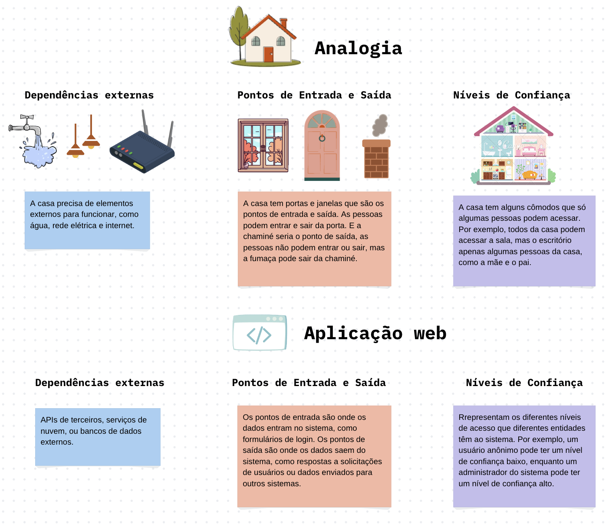
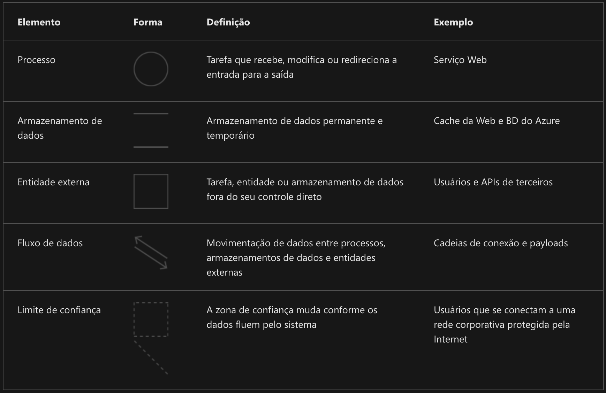
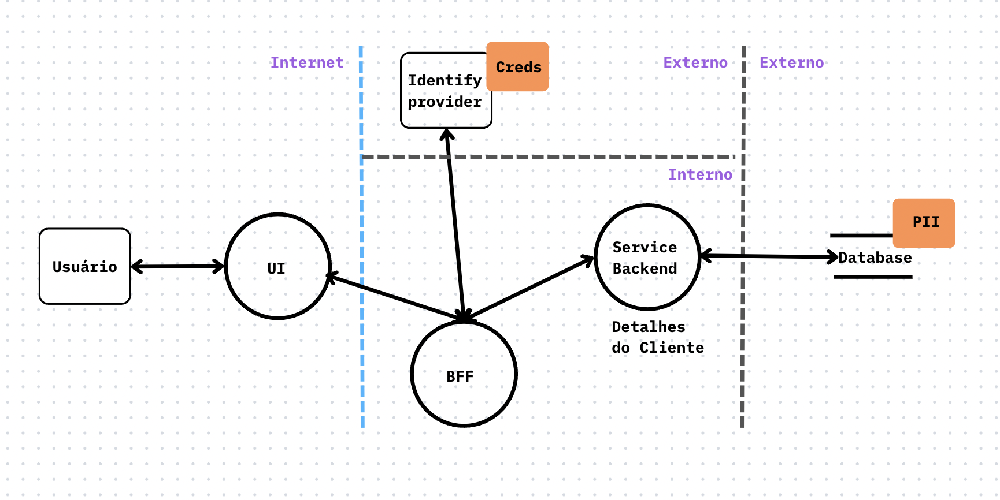

👾 [Inicio](https://rayanepimentel.github.io/InfoSec-iniciante/) | [Cronograma](https://rayanepimentel.github.io/InfoSec-iniciante/cronograma/) | [Cursos](https://rayanepimentel.github.io/InfoSec-iniciante/cursos/) | [Desenvolvimento Seguro](https://rayanepimentel.github.io/InfoSec-iniciante/cursos/desenvolvimento-seguro/) | [Modelagem de Ameaça](https://rayanepimentel.github.io/InfoSec-iniciante/cursos/desenvolvimento-seguro/modelagem-ameaca/00-modelagem)

# Decomposição da aplicacão

## Contexto

Digamos que você é uma desenvolvedora e foi chamada para participar de um reunião sobre de modelagem de ameaça de uma nova feature.

Primeira coisa que vamos fazer é descobrir o que essa feature faz:

História: 

    Eu como cliente, preciso de uma página onde possa ver os detalhes da minha conta, 
    para poder confirmar se estão corretos.

## Processo
<!-- 
Você precisa criar o processo, as evidencias da sua modelagem de ameaça, que servirá para consulta e analise prosteriormente. -->

O que precisa ter nesse documento? 

### Informações do modelo de ameaça

Informações sobre a equipe e o projeto:

**Nome da Aplicação**: O nome da aplicação 
**Versão da aplicação**: versão da aplicação examinada  
**Descrição**: descrição detalhada da aplicação 
**Proprietário**: proprietário do documento de modelagem de ameaças 
**Participantes**: participantes envolvidos no processo de moldagem de ameaças para essa aplicação 
**Revisor**: revisor(es) do modelo de ameaça.  

Por exemplo

**Informações sobre o modelo de ameaça**

**Versão da aplicação**: 1.0  
**Descrição**: Usuário precisa visualizar os seus dados, para poder confirmar se estão corretos.  
**Proprietário**: Rayane Pimentel  
**Participantes**: Any Maria  
**Revisor**: Joana Daria  

### Dependências externas

São itens externos ao código da aplicação que podem representar uma ameaça a aplicação. 
Esses itens normalmente ainda estão sob o controle da organização, mas possivelmente não estão sob o controle da equipe de desenvolvimento. Precisa investigar dependências externas e o ambiente de produção e os requisitos. 

Esta fase de decompor a aplicação serve para mapearmos o que existe.

Incluir na documentação: 

- ID: ID exclusivo atribuído a dependência externa
- Descrição: descrição contextual da dependência externa

Exemplo: **Dependências externas**

|ID|Descrição |
|--|--|
|1 |O usuário acessará a página através de um browser qualquer que tenha à disposição, como Chrome ou Firefox.|
|2 |A conexão entre o servidor web e o servidor de banco de dados será através de uma rede privada.|
|3 |O banco de dados é hospedado em um serviço de armazenamento em nuvem|

### Pontos de entrada

Define as interfaces por meio das quais os invasores podem interagir com a aplicação.
Os pontos de ataques de uma aplicação podem ser em camadas. Ex: cada pag da web em uma aplicação web pode conter múltiplos pontos de entrada.

* Pontos de entrada: Onde os dados entram no sistema? 
* Pontos de saída: Onde os dados saem no sistema?

> Quando nos referimos a um lugar em que um usuário pode interagir, chamamos isso de Ponto de Entrada

Os pontos de entrada e saída definem um limite de confiaça.

- ID: ID exclusivo ao ponto de entrada. Será usado para cruzar o ponto de entrada com quaisquer ameaças ou vulnerabilidades encontradas. 
- Nome: nome descritivo que identifica o ponto de entrada e sua finalidade
- Descrição: descrição contextual detalhando a interação ou processamento que ocorrer no ponto de entrada
- Níveis de confiança: o nível de acesso exigido no ponto de entrada. Esses serão cruzados com os níveis de confiança definidos posteriormente no documento. É nível de autorização que a pessoa que vai interagir com este ponto precisa ter.

Exemplo: **Pontos de entrada**

|ID	  |Nome             |Descrição   |	Níveis de confiança|
|--|--| -- | --|
|1| Acesso a pagina de "Detalhes da conta"| Onde usuário verá seus dados| Usuário precisa tá autenticado.
|2| Solicitação de dados do cliente |Serviço(Backend), recebe solicitação para informar os dados do cliente | Usuário com credenciais válidas.|

### Pontos de saída

> 

Ativos

O sistema deve ter algo que interesse o invasor; esses itens ou áreas são definidos como ativos.

* Ativos são alvos do atacantes - razão pela qual as ameaças existirão.
    * Ativos físicos - informações pessoais
    * Ativos abstratos - reputação da empresa

- ID: exclusivo, será usado para crear o ativo com quaisquer ameaças ou vulnerabilidades identificadas.
- Nome: nome que identifica claramente o alvo
- Descrição: descrição contextual do que é o ativo e pq ele precisa ser protegido
- Níveis de confiança: o nível de acesso necessário para acessar o ponto de entrada está documentado aqui. Estes serrano cruzados com os níveis de confiança definidos na próxima etapa.

Exemplo: **Pontos de saída**

|ID	|Nome	|Descrição	|Níveis de confiança|
|--|--| -- | --|
|1 | Usuários(cliente)| |
|1.1| Detalhe de login | Credenciais de login do usuário |Usuário com credencial válida |
|1.2|Dados pessoais| Dados que a aplicação armazenará informações pessoais relacionadas aos clientes|Usuários|
|1.3|Interface Frontend (UI)|A interface web onde os usuários visualizam e editem seus detalhes de perfil.| Usuário autenticado
|1.4|Serviço de Backend para Detalhes do Cliente|O serviço responsável por gerenciar os dados do perfil do cliente e interagir com o Banco de Dados.|Serviço de Backend|
|1.5|Banco de dados |O armazenamento onde os dados do perfil do cliente são armazenados.|Acesso restrito ao Serviço de Backend|

### Níveis de confiança

Os níveis de confiança representam os direitos de acesso que a aplicação concederá a entidades externas. Os níveis de confiança são cruzados com os pontos de entrada e ativos. Isso permite-nos definir os direitos de acesso ou privilégios necessários em cada ponto de entrada e aqueles necessários para interagir com cada ativo.

> Os níveis de confiança referem-se ao nível de acesso necessário em cada ponto de entrada/sa;ida para interagir com a aplicação ou fornecer dados a ela.

- ID: Exclusivo e atribuído a cada nível de confiança. 
- Nome: nome descritivo que permite identificar as entidades externas as quais foi concedido esse nível de confiança
- Descrição: descrição textual do nível de confiança detalhando a entidade externa a quem foi concedido o nível de confiança.

|ID	|Nome	|Descrição|
|--|--| --|
|1	|Usuário anonimo da web	|Um usuário que se conectou ao site, mas não forneceu credenciais válidas.|
|2  |Usuário com credenciais de login válidas| Um usuário que se conectou ao site da faculdade e fez login usando credenciais de login válidas.|
|3|Usuário com credenciais de login inválido|Um usuário que se conectou ao site da faculdade e está tentando fazer login usando credenciais de login inválidas.|

### Diagramas de Fluxo de Dados

#### Elementos do diagrama do fluxo de dados

 

 

[< Anterior](01-coletar-inform.md) | [Próxima >](03-determinarAmeaca.md)
