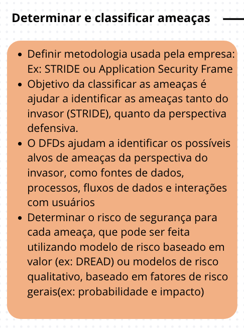
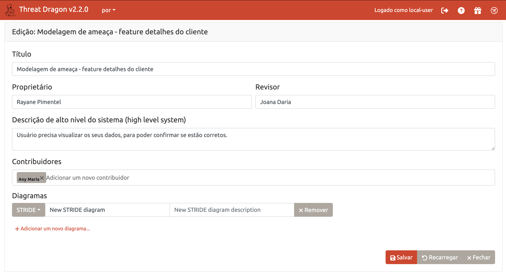
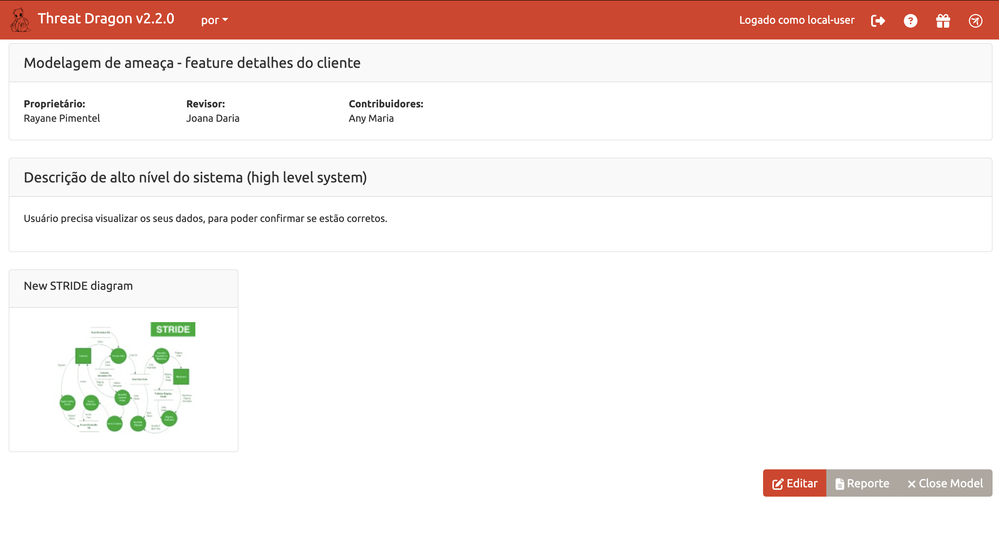
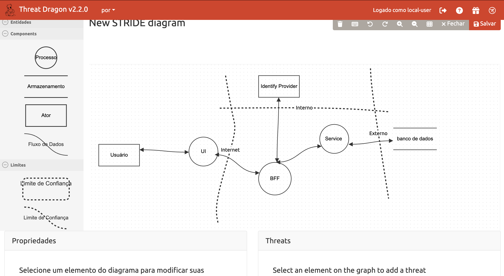
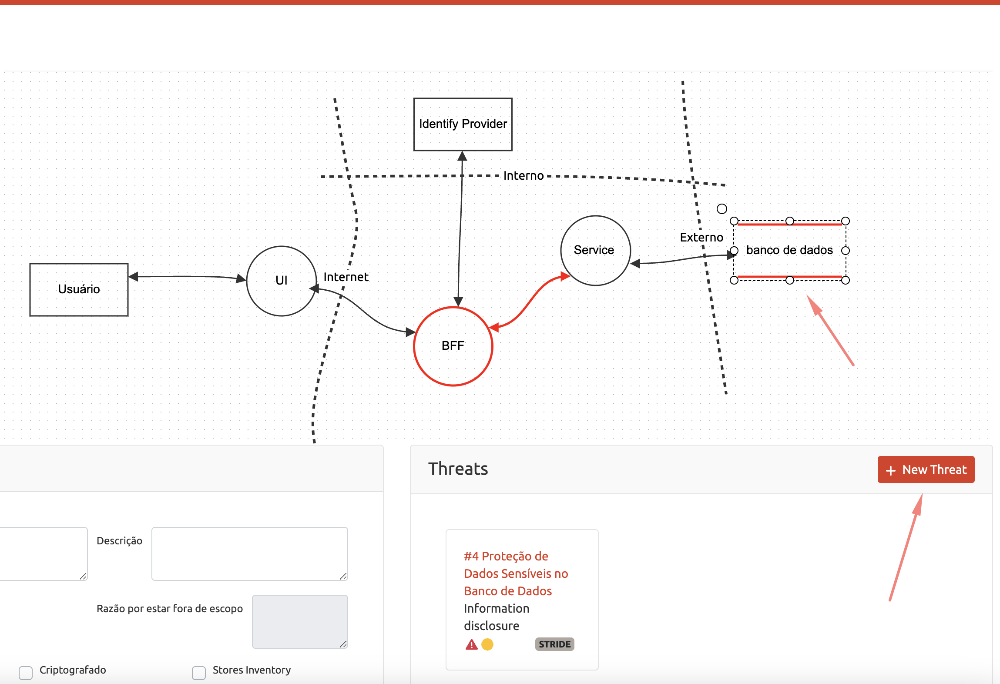
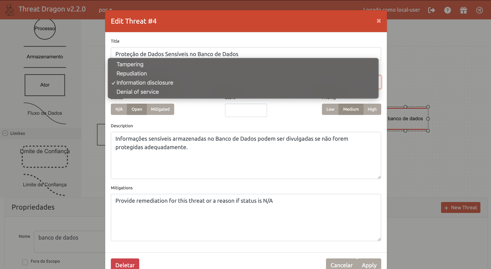

👾 [Inicio](https://rayanepimentel.github.io/InfoSec-iniciante/) | [Cronograma](https://rayanepimentel.github.io/InfoSec-iniciante/cronograma/) | [Cursos](https://rayanepimentel.github.io/InfoSec-iniciante/cursos/) | [Desenvolvimento Seguro](https://rayanepimentel.github.io/InfoSec-iniciante/cursos/desenvolvimento-seguro/) | [Modelagem de Ameaça](https://rayanepimentel.github.io/InfoSec-iniciante/cursos/desenvolvimento-seguro/modelagem-ameaca/00-modelagem)

# Determinar e classificar as ameaças

## STRIDE

O modelo de ameaça STRIDE é um modelo focado para identificar e classificar ameaças sob 6 tipos de ataques – **Spoofing, Tampering, Repudiation, Information Disclosure, Denial of Service, Elevation of Privilege.**

Vamos entender um pouco sobre esses ataques:

|Ameaça | Controle | Definição | Exemplo |
|--------|---------|-----------|----------|
|Spoofing | Autenticação | Quando o atacante finge ser outra pessoa | Ataque de phishing, onde o atacante finge ser outra pessoa, para obter alguma vantagem |
|Tampering| Integridade | Quando o atacante modifica alguma informação | Atualizar a senha de outro usuário| 
|Repudiation| Não repúdio | Quando atacante faz uma operação ilegal ou maliciosa em um sistema e, em seguida, esconde todas as suas ações |O atacante fez várias ações usando uma rede anônima |
|Information Disclosure| Confiabilidade | Atacante tem acesso a informações que não deveria | Acesso a armazenamento em nuvem pública que lida com documentos confidenciais|
|Denial of Service| Disponibilidade | Quando o atacante visam sobrecarregar e interromper o funcionamento normal de um sistema, sobrecarregando-o com tráfego excessivo, impedindo que usuários legítimos acessem | Ataque de DDoS|
|Elevation of Privilege| Autorização | Quando o atacante realiza ações que não é permitido, autorizado a fazer| Quando usuário comum, consegue ter as mesmas permissões que o usuário administrador. Podendo modificar, criar e excluir outros usuário|

## Como usar modelo STRIDE na nossa aplicação

Estou usando o Threat Dragon da OWASP

 

- Clica no componente
- Depois em "+ New Threat"

 

- Adicione title, tipo do STRIDE, descrição e determinar o risco(baixo, médio ou alto):

Para determinar o risco você pode usar essa tabela [https://chandanbn.github.io/cvss/](https://chandanbn.github.io/cvss/) ou [https://owasp-risk-rating.com/](https://owasp-risk-rating.com/)

## Priorize ameaças por risco!

Com uma lista de ameaças encontradas, o próximo passo é percorrer cada item e desenvolver estratégias para enfrentá-las. Para cada ameaça identificada, você tem a opção de adotar uma das quatro abordagens: **mitigar, eliminar, transferir ou aceitar**.

|Risco | Definição |
|------|-----------|
|**Mitigar**| É quando são tomadas ações para reduzir a probabilidade (de ocorrer) e/ou o (potencial) impacto negativo dela.| |
|**Eliminar**| É quando são tomadas ações para remover essa ameaça do projeto.| |
|**Transferir**| É quando o impacto dela é transferido/compartilhado para terceiros.| |
|**Aceitar** | É quando não é tomada nenhuma ação para lidar com ela. O custo para mitigar essa vulnerabilidade é alto e a probabilidade de ocorrer é baixa. | 

## Mitigações

- Mitigações será no próximo passo.

 

 

[< Anterior](02-decomposicaoApp.md) | [Próxima >](04-contramedidas-mitigacao.md)