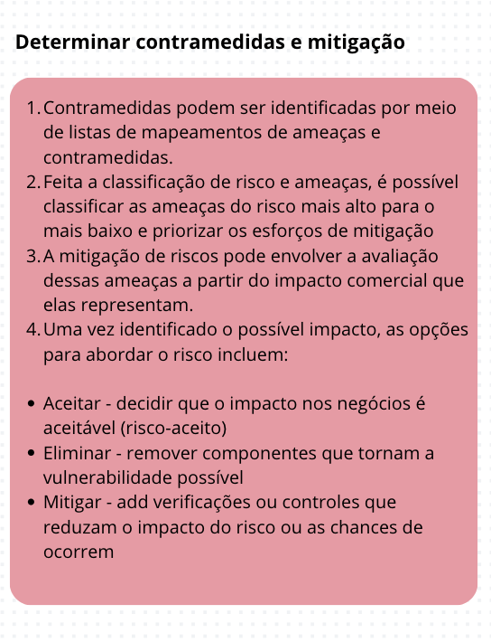
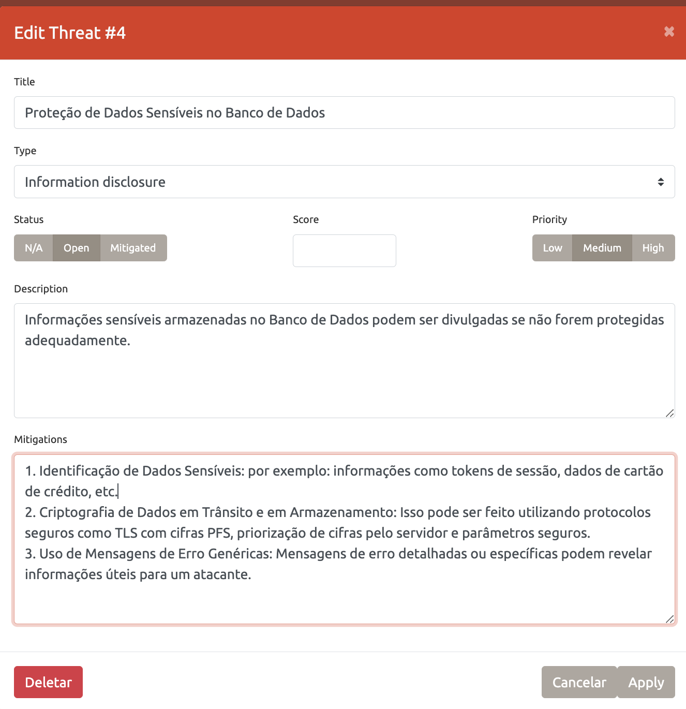
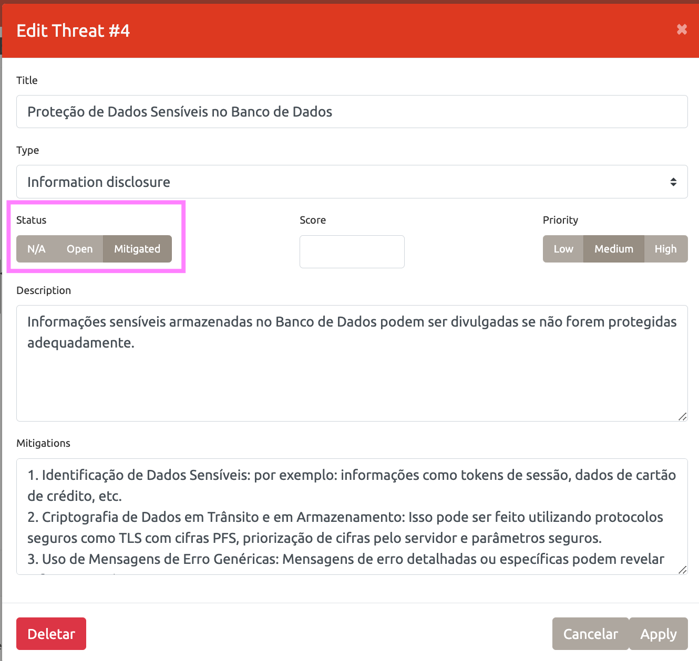
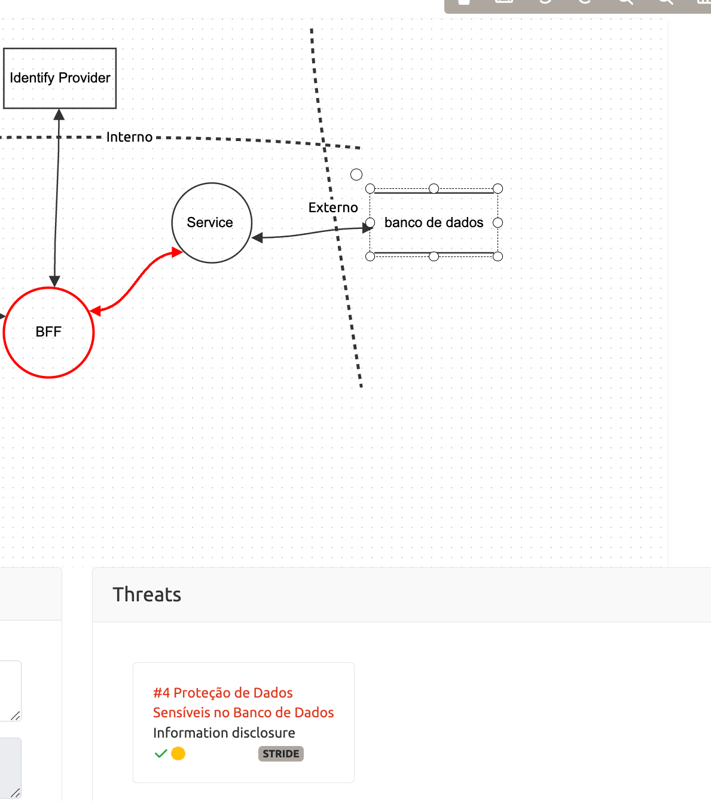

👾 [Inicio](https://rayanepimentel.github.io/InfoSec-iniciante/) | [Cronograma](https://rayanepimentel.github.io/InfoSec-iniciante/cronograma/) | [Cursos](https://rayanepimentel.github.io/InfoSec-iniciante/cursos/) | [Desenvolvimento Seguro](https://rayanepimentel.github.io/InfoSec-iniciante/cursos/desenvolvimento-seguro/) | [Modelagem de Ameaça](https://rayanepimentel.github.io/InfoSec-iniciante/cursos/desenvolvimento-seguro/modelagem-ameaca/00-modelagem)

# Determinar Contramedidas e Mitigação

> Após a identificação e classificação das ameaças, são definidas contramedidas específicas para mitigar cada uma delas. Isso pode incluir a implementação de medidas de segurança, como autenticação forte, criptografia de dados e validação de entrada 

## Contramedidas e Mitigação

Em [Determinar Ameaças](03-determinarAmeaca.md), usamos o modelo STRIDE e identificamos algumas vulnerabilidades e agora vamos adiconar ações de mitigação para cada um delas:

| Ameaça | Controle | Descrição | Mitigação |
|--------|----------|-----------| --------- |
| Information disclosure(divulgação de informações) | Autorização | Informações sensíveis armazenadas no Banco de Dados podem ser divulgadas se não forem protegidas adequadamente.| 1. Identificação de Dados Sensíveis; 2. Criptografia de Dados em Trânsito e em Armazenamento; 3. Uso de Mensagens de Erro Genéricas|

Para cada vulnerabilidade identificada, é necessário documentar as estratégias de mitigação para a equipe de desenvolvimento implementar.

Depois de mitigada é só alterar o status:

 

 

[< Anterior](03-determinarAmeaca.md) | [Inicio >](00-modelagem.md)