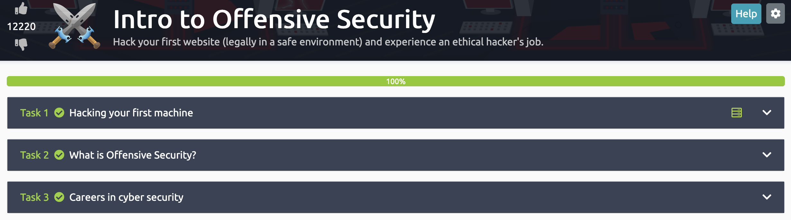

# Dia 2 - Conhecendo Cybersecurity
Crie sua conta em https://tryhackme.com/ e se Inscreva na trilha:
- Introduction to Cybersecurity e escolha a sala **Introduction to Defensive Security**. 
- Caso você já tenha realizado essa sala antes, recomendo exercitar sua escrita, escrevendo um relatório sobre a sala 'Intro to Offensive Security'.

## 02/30 :white_check_mark:

### Relatório

Link do laboratório: [Lab - Introduction to Defensive Securit](https://tryhackme.com/room/introtooffensivesecurity)

#### Task 1 Hacking your first machine 

Foi apresentado o site **FakeBank**, que se trata de um sistema bancário onde existe uma falha de segurança nas transações bancárias. E temos autorização para analisarmos(por se tratar de um banco fake, mas na vida real precisarimos de um "contrato" detalhado do que podemos analisar)

Precisamos encontrar páginas ocultas do site **FakeBank** com o **GoBuster**. 

```bash
Command: gobuster -u <target> -w wordlist.txt dir
-u = para indicar o site que estamos verificando, a url
-w = lista de palavras para percorrer para encontrar páginas ocultas, é o "dicionário"(wordlist.txt) onde estão as palavras.
dir = é o tipo, diretório
```
Foi retornando 1 diretório com **status 200**, ou seja podemos acessar.

```bash
/bank-transfer
```

Esse diretetório é a vulnerabilidade que estamos procurando, com esse diretório o invasor pode transferir o dinheiro de qualquer conta bancária para ele. 

Como hacker ético, reportamos ao sistema bancário para a corrigirem a vulnerabilidade.

