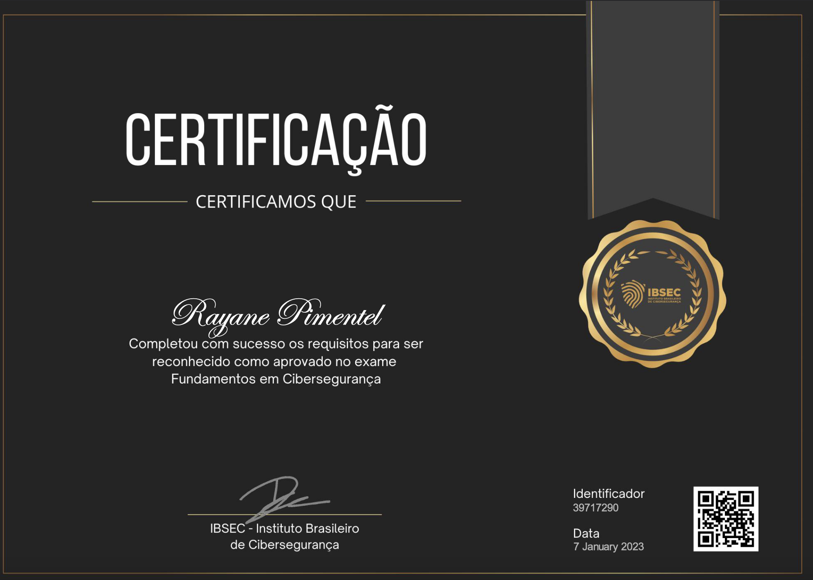

# Dia 04 - Hora de certificar

- Acesse o site https://ibsec.com.br/certificacao-fundamentos-em-ciberseguranca-gratuita/ e responda ao questionário para se certificar. 
- Caso você não obtenha a pontuação necessária para a certificação, faça uma lista dos tópicos que você sentiu dificuldade.

## 04/30 :white_check_mark:

