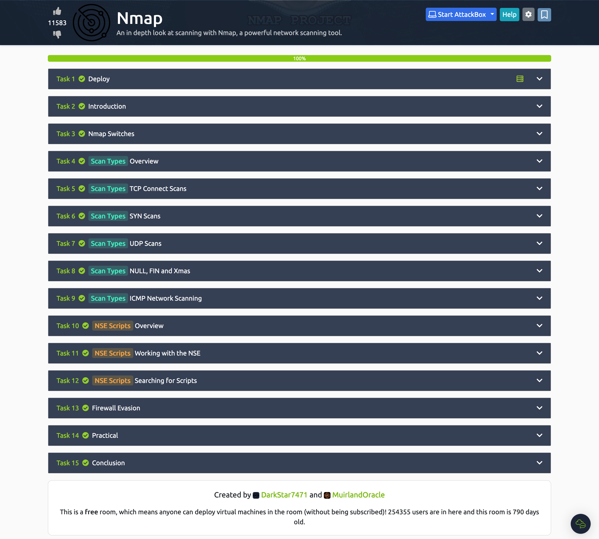

# Dia 19 - Mapeando a rede

- Conheça melhor a ferramenta Nmap. Pra isso você pode acessar a documentação nesse link: https://nmap.org/docs.html
- ou se preferir algo mais prático, acesse a sala https://tryhackme.com/room/furthernmap e entenda os comandos mais básicos.

## NMAP

1. Varredura de portas - entender o que é eescaneamento de portas.

Tipos básicos de escaneamentos:

- Varreduras de Conexão TCP ( -sT)
- SYN Varreduras "semi-abertas" ( -sS)
- Varreduras UDP ( -sU)

Concluído!

