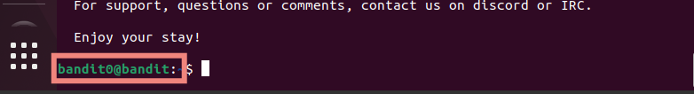
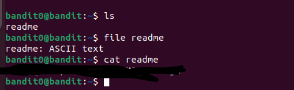

# Desafios "overthewire"

Link: [https://overthewire.org/wargames/bandit][def]

[def]: https://overthewire.org/wargames/bandit

## Bandit Level 0 → Level 1

[https://overthewire.org/wargames/bandit/bandit1.html](https://overthewire.org/wargames/bandit/bandit1.html)


> Basicamente precisamos encontrar o arquivo readme, abri-lo e lá estará a senha.

No Level00, conseguimos logar no usuário Bandit0, então vamos pular essar parte de logar via SSH para esse nivel(já que estaremos logado :D )

O desafio nos dar alguns comandos interessantes:

  
- ls: O comando `ls` é usado para listar o conteúdo de um diretório. Ele exibe os arquivos e diretórios presentes no diretório atual ou em um diretório especificado.

- cd: O comando `cd` é usado para mudar o diretório atual. Ele permite que você navegue entre diferentes diretórios no sistema de arquivos. Por exemplo, você pode usar `cd /caminho/do/diretorio` para entrar em um diretório específico.

- cat: O comando `cat` é usado para exibir o conteúdo de um arquivo de texto no terminal. Ele pode ser usado para visualizar o conteúdo de um único arquivo ou para combinar e exibir o conteúdo de vários arquivos.

- file: O comando `file` é usado para determinar o tipo de um arquivo. Ele examina a estrutura interna do arquivo e fornece informações sobre seu tipo, como texto, imagem, áudio, etc.

- du: O comando `du` é usado para exibir o uso de espaço em disco por arquivos e diretórios. Ele pode ser útil para determinar quais arquivos estão ocupando mais espaço em seu sistema.

- find: O comando `find` é usado para localizar arquivos e diretórios com base em critérios específicos, como nome, data de modificação, tamanho, permissões, etc. Ele ajuda a realizar buscas complexas no sistema de arquivos.


### Desafio

Certifique que você esteja no usuário `bandti0`



Agora vamos lista o contéudo desse diretório:

```bash
$ ls
readme
```
Retornou `readme`, que é o que estamos procurando.<br>

Você sabe dizer se ele é um arquivo ou uma pasta? Para sabermos disso, podemos usar o `file`

```bash
$ file readme
readme: ASCII text
```
É um arquivo de texto, então podemos usar o `cat` para visualizar o seu conteúdo:

```bash
$ cat readme
[retornou uma série de caracteres]
```

Essa série de caracteres será a senha utilizada para fazer login no próximo nível. Por favor, salve-a.

Desafio resolvido \o/

