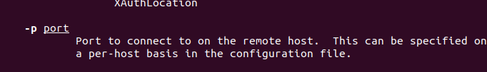
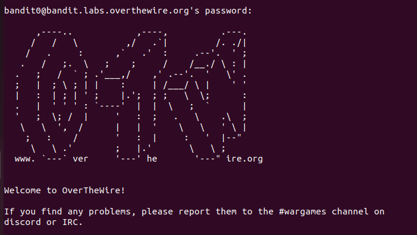

# Desafios "overthewire"

Link: [https://overthewire.org/wargames/bandit][def]

[def]: https://overthewire.org/wargames/bandit

## Level 00

[https://overthewire.org/wargames/bandit/bandit0.html](https://overthewire.org/wargames/bandit/bandit0.html)

Esse foi basicamente logar na máquina via ssh.

**Você sabe o que é "logar via ssh"? **

SSH é um protocolo, *Protocolo SSH (Secure Socket Shell) *, é um método utilizado para conectar remotamente permitindo a conexão entre cliente e servidor, de forma segura.

**O funcionamento do protocolo**

Na prática, o SSH fornece o mecanismo para que haja a autenticação desse usuário remoto, garantindo que essa pessoa tenha autorização para se comunicar com o servidor. Dessa maneira, é criada a conexão por meio do protocolo e as informações são transportadas nesse modelo de secure shell, com a criptografia que protege os dados.

Como acessar o protocolo SSH?
		
| | | |
|--|--|--|
|Tipo| Como| Exemplo |
|Com login e senha|Site |```$ ssh [username]@nomedosite.com.br```|
|Com login e senha| IP |```$ ssh [username]@[server IP address]``` |
|Usando chaves SSH |SSH key pair|```$ ssh-copy-id -i ~/.ssh/id_rsa.pub user@server``` |


```md
Se quiser ler o resumo completo sobre o protocolo SSH, clique no link a seguir. Leia as referencias que eu deixei também.
[Protocolo SSH](https://github.com/rayanepimentel/InfoSec-iniciante/blob/main/redes/redes-iniciante/parte1/1.protocolosDeRede.md#7-ssh)

```
### Desafio

Agora que sabemos o que é SSH e como se conectar, vamos logar!

O que diz o desafio: Logar via SSH <br>
Informações:

- Temos o host: `bandit.labs.overthewire.org`
- A porta (nesse desafio precisamos da porta): `2220`
- Nome do usuario: `bandit0`
- Senha: `bandit0`

Como vimos anteriormente podemos logar com "login e senha"

| | | |
|--|--|--|
|Tipo| Como| Exemplo |
|Com login e senha|Site |```$ ssh [username]@nomedosite.com.br```|

Mas temos uma informação: precisa ser na porta 2220.

- Primeiro vamos saber o que significa essa porta. <br>
Encontrei essa explicação: [https://tcp-udp-ports.com/port-2220.htm](https://tcp-udp-ports.com/port-2220.htm)

- Agora vamos saber como conectar via ssh ultizando a porta 2220.<br>
No terminal digite `man ssh`, vai listar o manual do ssh.


Vimos que tem `[-p port]`, que podemos usar para porta `-p 2220`



Sabendo disso, então ficaria assim:

```bash
ssh bandit0@bandit.labs.overthewire.org -p 2220
```
- Vai aparecer uma pergunta: `yes`
- Digite a senha: `bandit0`




Login feito com sucesso \o/

[Para sair: `exit`]
