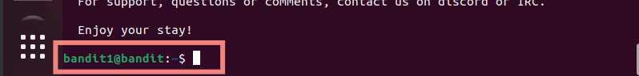
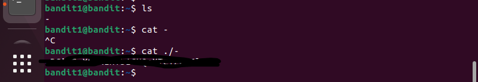

# Desafios "overthewire"

Link: [https://overthewire.org/wargames/bandit][def]

[def]: https://overthewire.org/wargames/bandit

## Bandit Level 1 → Level 2

[https://overthewire.org/wargames/bandit/bandit2.html](https://overthewire.org/wargames/bandit/bandit2.html)


> A senha para o próximo nível é armazenada em um arquivo chamado `-` localizado no diretório inicial.

Aqui precisamos logar no usuário bandit1, com a senha encontrada no desafio anterior.

```bash
$ ssh -p 2220 bandit1@bandit.labs.overthewire.org 
```



Ao listar os arquivos nesse diretório, encontramos o arquivo `-`

Ao digitar `cat -`, nada acontece, pq ele espera que `-` seja usado como argumento, igual o `-p 2220` que utilizamos para logar via SSH na porta 2220, então ele fica esperando uma entrada do usuário.

O desafio deixa uma pista para pesquisarmos sobre `dashed filename`.

Aqui encontrei uma boa solução: 

[https://www.golinuxcloud.com/overview-bash-dashed-filename-directory-linux/](https://www.golinuxcloud.com/overview-bash-dashed-filename-directory-linux/)

```bash
$ cat ./-
[retornou uma série de caracteres]
```

Essa série de caracteres será a senha utilizada para fazer login no próximo nível. Por favor, salve-a.

Desafio resolvido \o/

