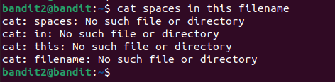
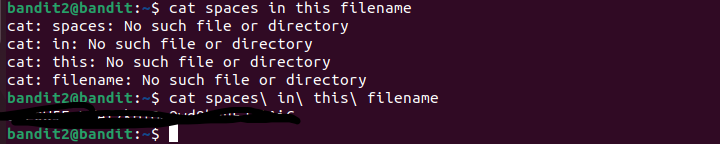

# Desafios "overthewire"

Link: [https://overthewire.org/wargames/bandit][def]

[def]: https://overthewire.org/wargames/bandit

## Bandit Level 2 → Level 3

[https://overthewire.org/wargames/bandit/bandit3.html](https://overthewire.org/wargames/bandit/bandit3.html)

> A senha para o próximo nível é armazenada em um arquivo chamado `spaces in this filename` localizado no diretório inicial 
`
Aqui precisamos logar no usuário bandit2, com a senha encontrada no desafio anterior.

```bash
$ ssh -p 2220 bandit2@bandit.labs.overthewire.org 
```


Ao listar os arquivos nesse diretório, encontramos o arquivo `spaces in this filename`

Se você colocar `cat spaces in the filename`, não funcionará:

```bash
$ cat spaces in the filename
```


Isso acontece pq ele trata spaces, in, the, filename, como arquivos diferentes e não um único arquivo.

Para entender pq isso acontece, você pode pesquisar sobre `spaces in filename`

Aqui tem uma boa explicacão: [https://linuxhandbook.com/filename-spaces-linux/](https://linuxhandbook.com/filename-spaces-linux/)

Umas das soluções que eu já conhecia era essa:

> Ao digitar cat spaces e depois `tab` para ir complentando o nome do arquivo, ficará com barra invertida: `cat spaces\ in\ the\ filename`, assim o cat entende o arquivo com espaços.

```bash
$ cat spaces\ in\ the\ filename
[retornou uma série de caracteres]
```

Essa série de caracteres será a senha utilizada para fazer login no próximo nível. Por favor, salve-a.

Desafio resolvido \o/



