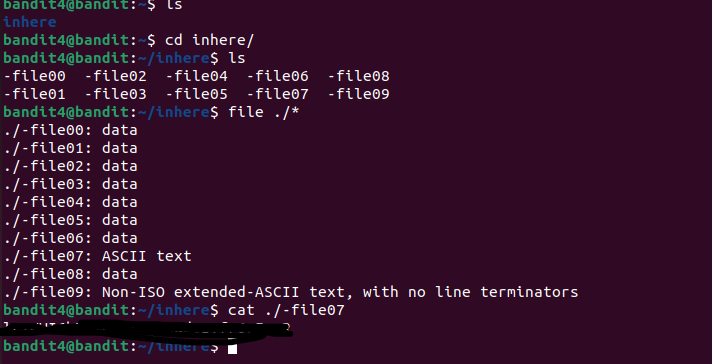

# Desafios "overthewire"

Link: [https://overthewire.org/wargames/bandit][def]

[def]: https://overthewire.org/wargames/bandit

## Bandit Level 4 → Level 5

[https://overthewire.org/wargames/bandit/bandit5.html](https://overthewire.org/wargames/bandit/bandit5.html)

> Basicamente precisamos encontrar um arquivo que está no diretório `inhere`

Aqui precisamos logar no usuário bandit4, com a senha encontrada no desafio anterior.

```bash
$ ssh -p 2220 bandit4@bandit.labs.overthewire.org 
```

Ao listar os arquivos nesse diretório, encontramos o diretório `inhere`.

Para entramos nesse diretório vamos utilizar o comando `cd`, como vimos no [Level01](level00-01.md)

```bash
~$ cd inhere
~/inhere$ ls
[retornou vários arquivos]
```

Temos vários arquivos `-file00` até `-file09`, podemos ir abrindo um por um ou podemos usar o `file` para listar todos os arquivos com o tipo.

Já tinhamos visto que file nomeArquivo, lista o tipo mas seria trabalhoso lista um por um também. Porém podemos utilizar um comando que lista todos de uma unica vez. 

```bash
~/inhere$ file ./* 
[retornou arquivos com o tipo]
```

Uns dos arquivos tem formato `ASCII text`, os demais são `data`.

```bash
~/inhere$ cat ./-file07
[retornou uma série de caracteres]
```

Essa série de caracteres será a senha utilizada para fazer login no próximo nível. Por favor, salve-a.

Desafio resolvido \o/


