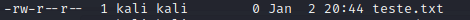
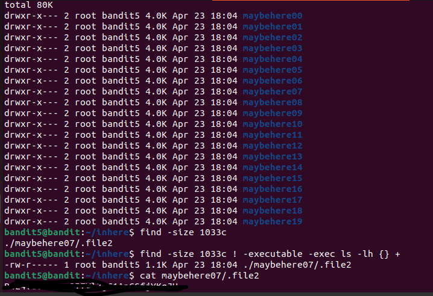

# Desafios "overthewire"

Link: [https://overthewire.org/wargames/bandit][def]

[def]: https://overthewire.org/wargames/bandit

## Bandit Level 5 → Level 6

[https://overthewire.org/wargames/bandit/bandit6.html](https://overthewire.org/wargames/bandit/bandit6.html)

> Basicamente precisamos encontrar um arquivo que está no diretório `inhere`, com essas três propriedades: 

 - human-readable
 - 1033 bytes in size
 - not executable


Precisamos logar no usuário bandit5, com a senha encontrada no desafio anterior.

```bash
$ ssh -p 2220 bandit5@bandit.labs.overthewire.org 
```

Ao lista o diretório `inhere`, retornou vários diretórios. Ou seja, o arquivo que estamos procurando estará dentro de algum desses diretórios. Assim como no nivel anterior, fica inviável entramos em arquivo por arquivo para encontramos a senha.

Nessa caso temos a condição das 3 propriedades.

1. human-readable: são arquivos ASCII text, podemos usar o `find`
2. 1033 bytes in size: podemos usar o `du` ou `find`
3. not executable

not executable, vamos entender como identificar um arquivo `not executable`

Se observamos  temos alguns arquivos e diretórios com letras. O que essas letras significam?


- Leitura → r - 4
- Escrita, permissão de gravação→ w - 2
- Execução → x -1

💡 
- `Leitura` permite ao usuário ler o conteúdo do arquivo mas não alterá-lo. 
- `Escrita` permite que o usuário altere o arquivo. 
- `Execução`, como o nome diz, permite que o usuário execute o arquivo, no caso de ser executável.


E são divididos em 3 partas:

- 1 → proprietário
- 2 → grupo
- 3 → outros usuários

Exemplo: 



- `-` → que dizer que é um arquivo e não um `d` diretório(pasta)
- `rw-` → a primeira parte significa permissões do proprietário, `leitura e escrita`(4,2)
- `r--` → a segunda parte significa permissões do grupo ao qual o usuário pertence, `leitura`(4)
- `r--` → a terceira parte significa permissões para os demais usuários, `leitura`(4)

E o que seria `4 - 2 - 1` (leitura - escrita - executável) ?

Seria Octal. Octal **é um sistema de números base 8 que usa os dígitos 0 a 7.**

Veja a tabela:

| 0 | --- | nenhuma permissão |
| --- | --- | --- |
| 1 | --x | somente execução |
| 2 | -w- | somente escrita |
| 3 | -wx | escrita e execução |
| 4 | r-- | somente leitura |
| 5 | r-x | leitura e execução |
| 6 | rw- | eitura e escrita |
| 7 | rwx | leitura, escrita e execução |

| --------- | 000 | Nenhuma permissão |
| --- | --- | --- |
| r-------- | 400 | somente leitura para propriétário(4) |
| r--r--r-- | 444 | leitura para proprietário, grupo e outros usuários |
| rw------- | 600 | leitura e escrita somente para proprietário(4+2 = 6) |
| rw-r--r-- | 644 | leitura e escrita para proprietário(6), leitura para grupo e para outros |
| rw-rw-rw- | 666 | leitura e escrita para proprietário, grupo e outros. |
| rwx------ | 700 | leitura, escrita e executável somente para proprietário(4+2+1=7) |
| rwxr-x--- | 750 | leitura, escrita e executável  para proprietário(4+2+1=7), leitura e executavel para grupo(4+3) |

Fonte: [infowester](https://www.infowester.com/linuxpermissoes.php)


1. Ou seja, precisamos que o arquivo não seja executável, que ele não tenha `x`
2. Que o tamanho seja `1033 bytes `
3. E que seja legivel para humanos

Como o find conseguimos encontrar esse arquivo.

- find -size 1033c 

Pq 1033c? 


- b – blocos de 512 bytes (este é o padrão se nenhum sufixo for usado)
- c - bytes
- w - palavras de dois bytes
- k - quilobytes
- M – Megabytes
- G – Gigabytes

Com esse comando conseguimos encontrar apenas um arquivo, que provavelmente será o arquivo que tem a senha.

Mas para fins didáticos, vou fazer todo o processo

```bash
$ find -size 1033c ! -executable -exec ls -lh {} +
```

- `-size 1033c` : especifica o tamanho do arquivo desejado.
- `! -executable` :  exclui os arquivos executáveis.
- `-exec ls -lh {} +` : exibe informações detalhadas dos arquivos encontrados.

[Referência](https://linuxize.com/post/how-to-find-files-in-linux-using-the-command-line/)


Desafio resolvido \o/


