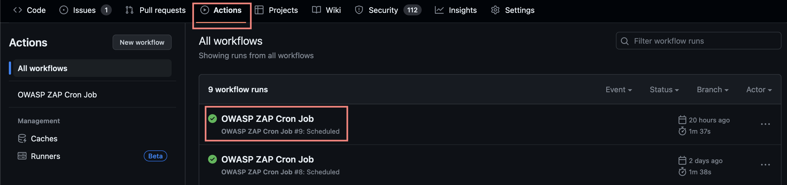
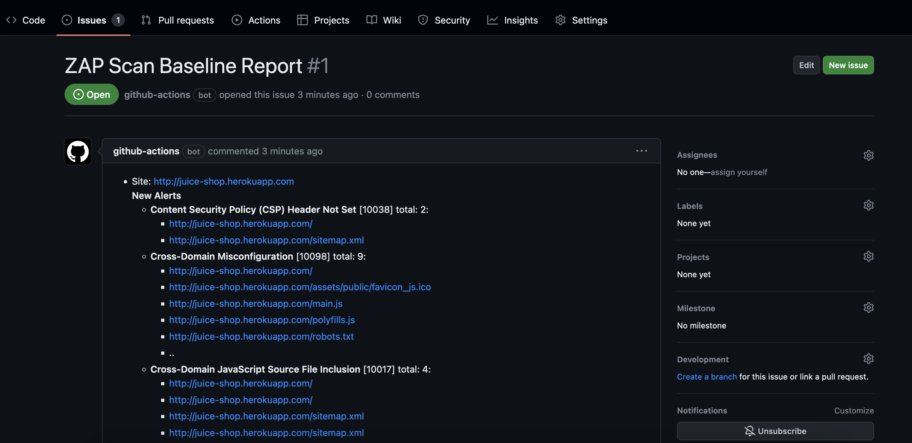

[Inicio](https://rayanepimentel.github.io/InfoSec-iniciante/) | [Cronograma](https://rayanepimentel.github.io/InfoSec-iniciante/site/cronograma/cronograma.html) | [DevSecOps](https://rayanepimentel.github.io/InfoSec-iniciante/devSecOps)

# Pipeline DAST

## Contexto

Se você não sabe o que é pipeline, DAST, Workflow e Github Actions, eu escrevi sobre [aqui](pipeline.md).

### Dast usado no exemplo

- Fonte: [OWASP ZAP](https://github.com/marketplace/actions/zap-baseline-scan)

## Implementação:

### GitHub Actions

- No seu projeto no GitHub, vá em "Actions" e clique em "set up a workflow yourself" ou procure por "Simple workflow".
- Isso abrirá um arquivo YAML.

### Configurando workflow

### Eventos:

- Vamos criar os eventos:

```yaml
name: OWASP ZAP
on:
  schedule:
    - cron: '0 6 * * *'
```
Nesse exemplo eu quero que todos os dias em um horario X, seja feita uma análise do projeto. <br>
Para isso vou usar o CronJob, o que é um CronJob? 

Utilizando cronJobs conseguimos agendar tarefas individuais para um horário específico, como por exemplo análise do site seja feita em um horário que não tenha tantos usuários online. Também podemos agendar para que seja feita mais de uma vez por dia. Veja mais [aqui](https://kubernetes.io/pt-br/docs/concepts/workloads/controllers/cron-jobs/)

No exemplo <strong>'0 6 * * *'</strong> indica que a tarefa será executada todos os dias às 6:00 da manhã baseada no horário UTC (Tempo Universal Coordenado).

Sintaxe do cronograma cron

```bash

# ┌───────────── minuto (0 - 59)
# │ ┌───────────── hora (0 - 23)
# │ │ ┌───────────── dia do mês (1 - 31)
# │ │ │ ┌───────────── mês (1 - 12)
# │ │ │ │ ┌───────────── dia da semana (0 - 6) (domingo a sábado;
# │ │ │ │ │                                 7 também representa domingo em alguns sistemas operacionais)
# │ │ │ │ │
# │ │ │ │ │
# * * * * *

```
> O editor rápido e simples para expressões de agendamento cron [https://crontab.guru/](https://crontab.guru/)

### Trabalhos

- Agora vamos definir os trabalhos

```yaml
jobs:
  dast:
    runs-on: ubuntu-latest
    steps:
      - name: Checkout código
        uses: actions/checkout@v2
      - name: Executar OWASP ZAP
        uses: zaproxy/action-baseline@v0.7.0
        with:
          token: ${{ secrets.GITHUB_TOKEN }}
          docker_name: 'ghcr.io/zaproxy/zaproxy:stable'
          target: 'http://juice-shop.herokuapp.com/'
          cmd_options: '-a'
```

- O nome do job será "dast".
- Irá rodar na máquina virtual Ubuntu.
- Etapas:
    1. Checkout código:
    - A primeira etapa é chamada "Checkout código" e usa a ação "actions/checkout@v2". Essa etapa é responsável por fazer o checkout do código-fonte do repositório no qual o trabalho está sendo executado.
    2. Executar OWASP ZAP:
    - A segunda etapa é chamada "Executar OWASP ZAP" e usa a ação "zaproxy/action-baseline@v0.7.0". Essa etapa é responsável por executar o OWASP ZAP. 
    - Possui um parâmetro chamado "with" que contém as configurações específicas para a execução do OWASP ZAP. 
    - token: ${{ secrets.GITHUB_TOKEN }}: Especifica o token do GitHub que será usado pela ação para criar e atualizar a issue para a varredura de linha de base. O ${{ secrets.GITHUB_TOKEN }} é um token fornecido pelo GitHub que não requer a criação de um token dedicado.
    - docker_name: 'ghcr.io/zaproxy/zaproxy:stable': Define o nome do arquivo Docker a ser executado. Por padrão, a ação executa a versão estável do ZAP. No caso desse exemplo, o nome do arquivo Docker é ghcr.io/zaproxy/zaproxy:stable.
    - target: 'http://juice-shop.herokuapp.com/': Especifica o URL do aplicativo da web que será varrido pelo ZAP. No exemplo, o URL é http://juice-shop.herokuapp.com/.
    - cmd_options: '-a': Define as opções de linha de comando que serão passadas para o ZAP durante a execução da varredura. A opção -a é específica para o OWASP ZAP e representa as regras de varredura passiva alpha. Essas regras são úteis para identificar possíveis problemas de segurança sem causar impacto no funcionamento do aplicativo em si.


Aqui está a configuração final do meu arquivo YAML:

```yaml
name: OWASP ZAP Cron Job
on:
  schedule:
    - cron: '0 6 * * *'
jobs:
  dast:
    runs-on: ubuntu-latest
    steps:
      - name: Checkout código
        uses: actions/checkout@v2
      - name: Executar OWASP ZAP
        uses: zaproxy/action-baseline@v0.7.0
        with:
          token: ${{ secrets.GITHUB_TOKEN }}
          docker_name: 'ghcr.io/zaproxy/zaproxy:stable'
          target: 'http://juice-shop.herokuapp.com/' # URL do seu site ou ip
          cmd_options: '-a'
```

Essa programação garanti que a análise seja executada no horário especificado.

Depois da análise feita com sucesso, você pode conferir em Actions  



Você receberá uma Issue chamada "ZAP Scan Baseline Report" contendo uma descrição das vulnerabilidades encontradas.




## OWASP ZAP 

### Com Cronjob:

No exemplo eu usei com o cronjob. Mas por que escolher essa abordagem? Quais são os benefícios do uso do cronjob com o OWASP ZAP?

A utilização de um cronjob permite automatizar a execução regular dos testes de segurança com o OWASP ZAP, umas das vantagens:

- Automação
- Descoberta precoce de problemas
- Monitoramento contínuo

Ou seja, se você deseja realizar verificações regulares e automatizadas, pode configurar um cronjob para executar o OWASP ZAP em intervalos específicos.


### Com push 

Dessa forma, o OWASP ZAP será executado automaticamente e verificará a segurança do site antes de cada push.

### Combinando Cron e Push:

Seria benéfico adotar ambas as abordagens, cronjob e push? Embora eu ainda esteja explorando essa área, é possível considerar isso uma boa prática. No entanto, a decisão de usar ambas as abordagens depende das necessidades e preferências específicas do seu projeto.

A combinação dessas duas abordagens pode ser altamente vantajosa, oferecendo um monitoramento contínuo através do cronjob, enquanto a verificação de segurança antes de cada push garante uma proteção mais abrangente.

Ao adotar essa abordagem, o nosso arquivo de configuração poderia ser ajustado da seguinte forma:

```yaml
name: OWASP ZAP Cron Job e Push
on:
  push:
    branches:
      - main
  schedule:
    - cron: '* 6 * * *'
jobs:
  dast:
    runs-on: ubuntu-latest
    steps:
      - name: Checkout código
        uses: actions/checkout@v2
      - name: Executar OWASP ZAP
        uses: zaproxy/action-baseline@v0.7.0
        with:
          token: ${{ secrets.GITHUB_TOKEN }}
          docker_name: 'ghcr.io/zaproxy/zaproxy:stable'
          target: 'http://juice-shop.herokuapp.com/'
          cmd_options: '-a'
```


## Referências:

- [https://www.zaproxy.org/blog/2020-05-15-dynamic-application-security-testing-with-zap-and-github-actions/](https://www.zaproxy.org/blog/2020-05-15-dynamic-application-security-testing-with-zap-and-github-actions/)
- [https://www.zaproxy.org/blog/2020-04-09-automate-security-testing-with-zap-and-github-actions/](https://www.zaproxy.org/blog/2020-04-09-automate-security-testing-with-zap-and-github-actions/)

