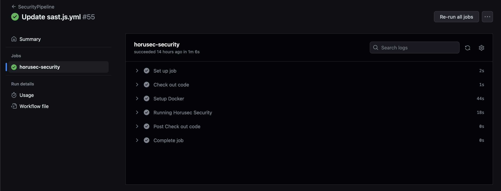
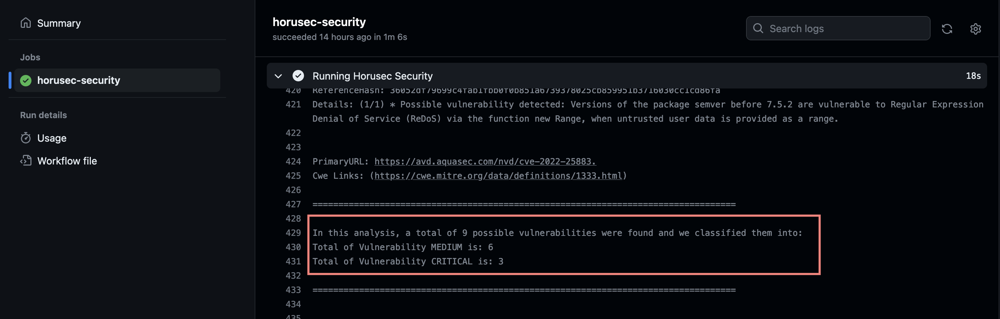

# Pipeline SAST

## Contexto

Se você não sabe o que é pipeline, SAST, Workflow e Github Actions, eu escrevi sobre [aqui](pipeline.md)

### Sast usado no exemplo
- Fonte: [https://github.com/marketplace/actions/horusec](https://github.com/marketplace/actions/horusec)

## Implementação:

### Instalação do Horusec no projeto
1. A primeira etapa é criar o arquivo `horusec-config.json` no seu projeto. Siga a documentação [aqui](https://docs.horusec.io/docs/pt-br/cli/installation/).
2. Depois, faça o commit do arquivo.

### GitHub Actions

- No seu projeto no GitHub, vá em "Actions" e clique em "set up a workflow yourself" ou procure por "Simple workflow".
- Isso abrirá um arquivo YAML.


### Configurando workflow

- Vamos criar os eventos:

```yaml
name: SecurityPipeline
on:
  push:
    branches: [ "main" ]
  pull_request:
    branches: [ "main" ]
```

- Agora vamos definir os trabalhos. Vamos usar a documentação do "Horusec": [https://github.com/marketplace/actions/horusec](https://docs.horusec.io/docs/pt-br/cli/installation/#github-actions)


```yaml
name: SecurityPipeline
on:
  push:
    branches: [ "main" ]
  pull_request:
    branches: [ "main" ]
Agora vamos definir os trabalhos. Vamos usar a documentação do "Horusec": https://github.com/marketplace/actions/horusec
yaml
Copy code
jobs:
  horusec-security:
    name: horusec-security
    runs-on: ubuntu-latest
    steps:
    - name: Check out code
      uses: actions/checkout@v2
      with: 
        fetch-depth: 0
    - name: Running Horusec Security
      run: |
        curl -fsSL https://raw.githubusercontent.com/ZupIT/horusec/main/deployments/scripts/install.sh | bash -s latest
        horusec start -p="./"
```
- O nome do job será "horusec-security".
- Irá rodar na máquina virtual Ubuntu.
- Etapas:
    - name: O que será usado para identificar a ação.
    - uses: Será a ação, como "actions/checkout@v2" para clonar o projeto.
    - with: Configurações adicionais para a ação "actions/checkout@v3".

- O primeiro comando utiliza o utilitário "curl" para fazer o download de um script de instalação do Horusec Security a partir do repositório GitHub da ZupIT. O script é executado usando o comando "bash" com o argumento "-s latest", que especifica a versão mais recente do Horusec Security a ser instalada.

- O segundo comando, "horusec start -p='./'", inicia a execução do Horusec Security no diretório atual ("./").

- Como estou usando o docker, preciso adicionar um **uses** para isso também.

Meu arquivo YAML ficou assim:

```yaml
name: SecurityPipeline

on:
#eventos
  push:
    branches: [ "main" ]
  pull_request:
    branches: [ "main" ]

jobs:
#trabalhos
  horusec-security:
    name: horusec-security
    runs-on: ubuntu-latest
    steps:
    - name: Check out code
      uses: actions/checkout@v2
      with: # Necessário quando habilitado o autores de commit
        fetch-depth: 0
    - name: Setup Docker
      uses: docker-practice/actions-setup-docker@v1
    - name: Running Horusec Security
      run: |
        curl -fsSL https://raw.githubusercontent.com/ZupIT/horusec/main/deployments/scripts/install.sh | bash -s latest
        horusec start -p="./"
```

Agora é só fazer o commit e subir esse arquivo yaml para master.

- Actions > clique no workflow 



Ao clicar em "Running Horusec Security", você verá a analise.


