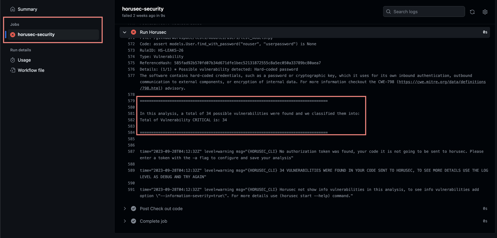

[Inicio](https://rayanepimentel.github.io/InfoSec-iniciante/) | [Cronograma](https://rayanepimentel.github.io/InfoSec-iniciante/site/cronograma/cronograma.html) | [DevSecOps](https://rayanepimentel.github.io/InfoSec-iniciante/devSecOps)

# Pipeline SAST

## Contexto

Se você não sabe o que é pipeline, SAST, Workflow e Github Actions, eu escrevi sobre [aqui](pipeline.md)

### Sast usado no exemplo
- Fonte: [https://github.com/marketplace/actions/horusec](https://github.com/marketplace/actions/horusec)

## Implementação:

### Instalação do Horusec no projeto
1. A primeira etapa é criar o arquivo `horusec-config.json` no seu projeto. Siga a documentação [aqui](https://docs.horusec.io/docs/pt-br/cli/installation/).
2. Depois, faça o commit do arquivo.

### GitHub Actions

- No seu projeto no GitHub, vá em "Actions" e clique em "set up a workflow yourself" ou procure por "Simple workflow".
- Isso abrirá um arquivo YAML.


### Configurando workflow

- Vamos criar os eventos:

```yaml
name: SecurityPipeline
on:
  push:
    branches: [ "main" ]
  pull_request:
    branches: [ "main" ]
```

- Agora vamos definir os trabalhos. Vamos usar a documentação do "Horusec": https://github.com/marketplace/actions/horusec

```yaml
jobs:
  horusec-security:
    name: horusec-security
    runs-on: ubuntu-latest
    steps:
    - name: Check out code
      uses: actions/checkout@v2
      with: 
        fetch-depth: 0
      - name: Run Horusec
        id: run_horusec
        uses: fike/horusec-action@v0.2.2
        with:
          arguments: -c=horusec-config.json -p ./
```
- O nome do **job** será `horusec-security`.
- Irá rodar na máquina virtual Ubuntu.
- Etapas:
    - |Tipo| Significado |
      |--|--|
      | **name** | O que será usado para identificar a ação. |
      | **uses** | Será a ação, como `actions/checkout@v2` para clonar o projeto.|
      |**with**|Configurações adicionais para a ação `actions/checkout@v3`.|
      | **name**| `Run Horusec`: Define um nome para essa etapa específica do fluxo de trabalho.|
      | **id**| `run_horusec`: Define um identificador único para essa etapa.|
      | **uses**|`fike/horusec-action@v0.2.2`: Essa ação é responsável por executar o Horusec no seu projeto.|
      | **with**| Define os argumentos a serem passados para a ação.|
      | | `arguments: -c=horusec-config.json -p ./` |
      | | `-c=horusec-config.json`: Especifica o arquivo de configuração do Horusec a ser usado(o que criamos lá no inicio)|
      | |`-p ./`: Especifica o diretório do projeto a ser analisado pelo Horusec. Nesse caso, o diretório atual é utilizado.|


Agora é só fazer o commit e subir esse arquivo yaml para master.

- Actions > clique no workflow 

Ao clicar em "Running Horusec Security", você verá a analise.




Análise:

- Vulnerabilidade encontrada: 34
- Nivel: Critical
- Pipeline fail

Ou seja, nesse cenário não vamos conseguir fazer o merge para `master` e a configuração horusec funcinou porque encontrou vulnerabilidades e quebrou o pipeline.


<br>
<hr>
<br>

[< Anterior](https://rayanepimentel.github.io/InfoSec-iniciante/devSecOps/pipeline.html) | [Próxima >](https://rayanepimentel.github.io/InfoSec-iniciante/devSecOps/sast-parte2.html)