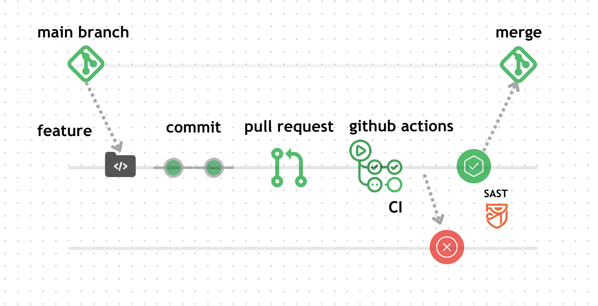
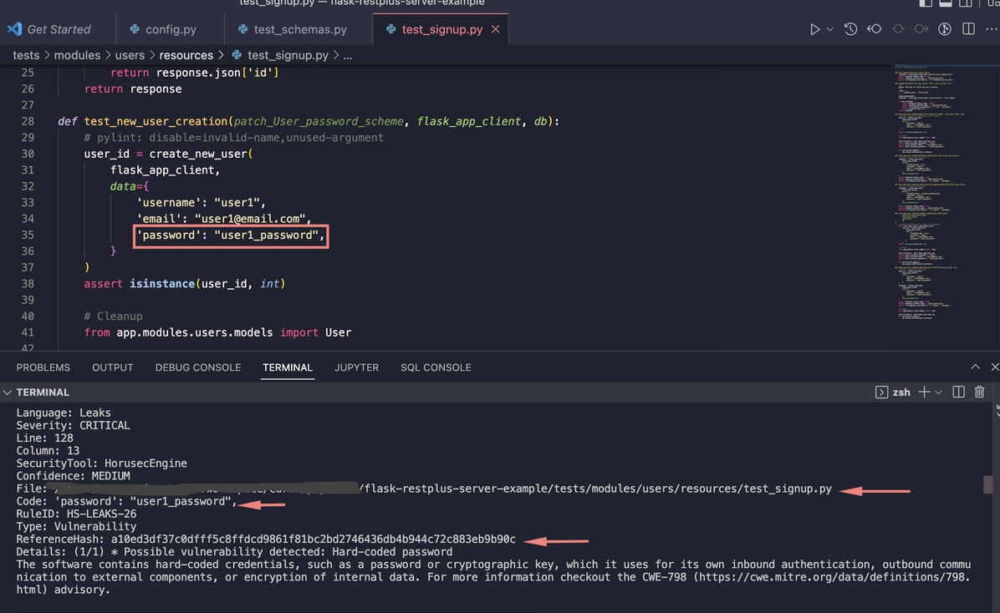
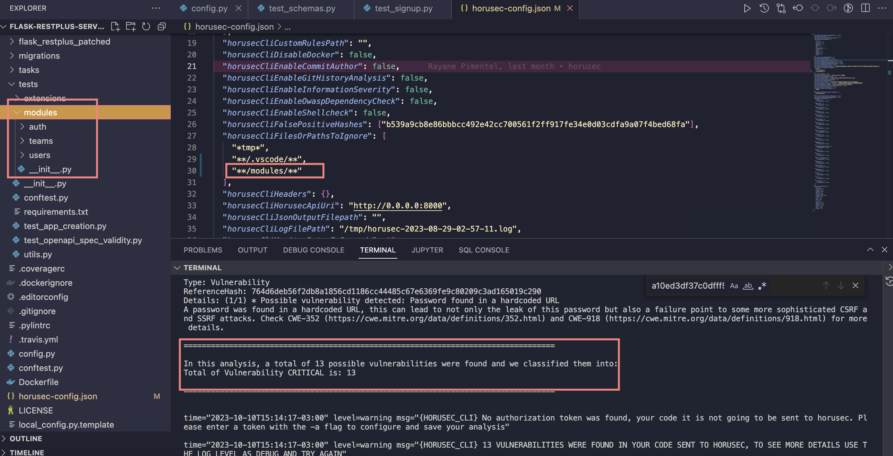
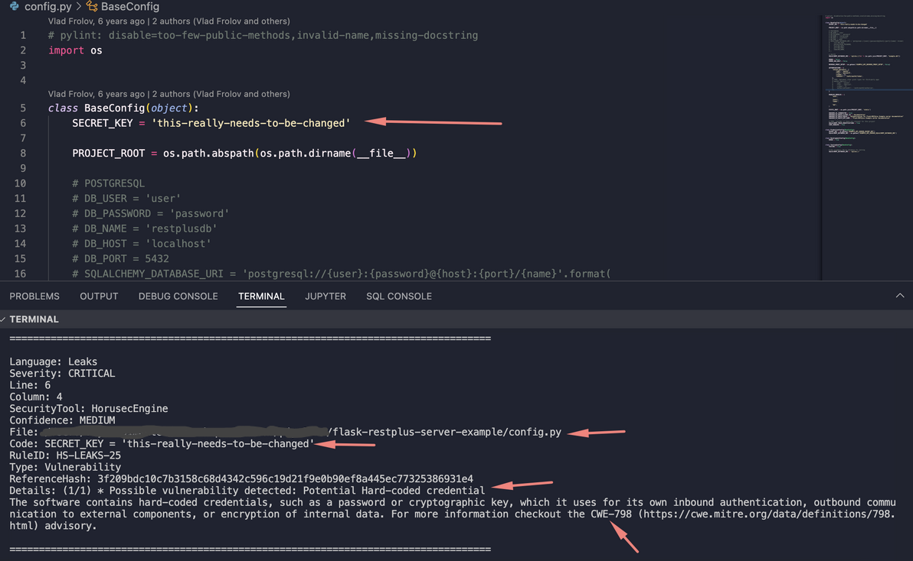
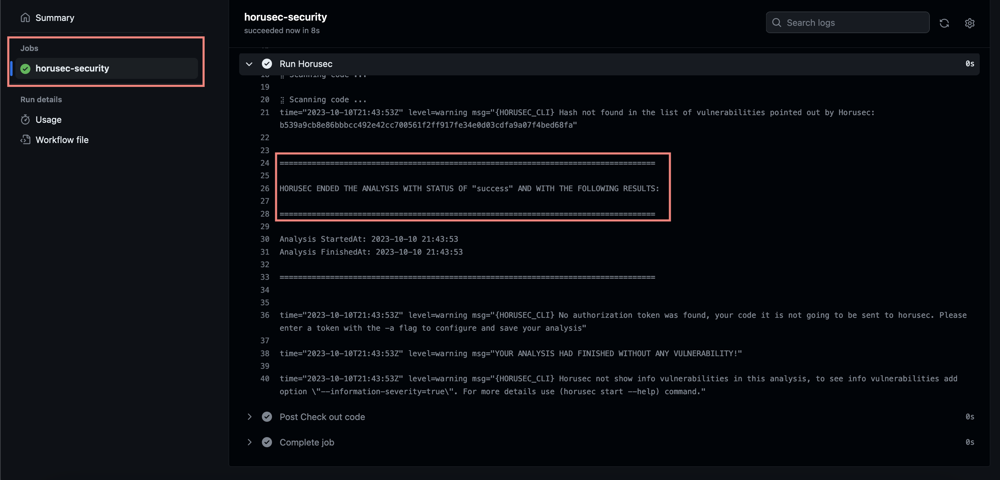

# Parte 2 - Configuração SAST

[Parte 1 - Pipeline SAST](pipeline-sast.md)


## SAST
O SAST que estamos utilizando é o [Horusec](https://docs.horusec.io/docs/pt-br/overview/)


## Onde estamos?


### Contexto





- `main`: main é o branch principal da aplicação. É o código estável.
- `feature`: é onde estamos escrevendo nossos códigos
- `commit`: commit das nossas alterações
- `push request`: estamos enviando uma solicitação para mesclar nossas alterações na `main`
- `github action`: quando criamos PR ou fazemos um push com `github actions` configurado, ele é acionado para executar os fluxos de trabalho definidos.
 - `CI`: Toda vez que ele foi acionado, ele executa o trabalho: clona o projeto, roda todos os testes, gerar o build(arquivos que você precisa para a aplicação rodar) da aplicação. E tbm no nosso caso, executa o Horusec.
 Ou seja, todas as vezes que fizermos um PR, esse processo garante que código de forma segura possa estar integrado na aplicação principal.
 - `horusec`: O Horusec é uma ferramenta de segurança que analisa o código em busca de vulnerabilidades de segurança.


No nosso exemplo:


- Irá rodar na máquina virtual Ubuntu
- Clonar o projeto
- Executar o Horusec no projeto, conforme o arquivo de configuração


```yaml
name: SecurityPipeline
on:
 push:
   branches: [ "main" ]
 pull_request:
   branches: [ "main" ]


jobs:
 horusec-security:
   name: horusec-security
   runs-on: ubuntu-latest
   steps:
   - name: Check out code
     uses: actions/checkout@v2
     with:
       fetch-depth: 0
     - name: Run Horusec
       id: run_horusec
       uses: fike/horusec-action@v0.2.2
       with:
         arguments: -c=horusec-config.json -p ./
```


## Análise - CLI


Como vimos o Horusec encontrou 34 vulnerabilidades e nesse caso precisamos analisar todas vulnerabilidade e classificá-las:


- `falso-positivo`: a ferramenta detectou com vulnerabilidade mas não é uma vulnerabilidade, ela não entendeu o contexto por isso classificou errado.
- `risco-aceito`: é uma vulnerabilidade mas por algum motivo a empresa aceita o risco, mas precisa de correção. O certo é não virar um débito técnico e sim entrar em um planejamento para próximas sprints.
- `vulnerabilidade`: uma possível falha de segurança foi encontrada e acusada na análise.


Quando identificamos `falso-positivo` e aceitamos `risco-aceito`, precisamos add o hash delas no arquivo `horusec-config.json`


- falso-positivo: `horusecCliFalsePositiveHashes`
- risco-aceito: `horusecCliRiskAcceptHashes`


Exemplo:


Rodei o Horusec no projeto(CLI) assim fica mais fácil para analisar.





- `File`: o caminho do arquivo
- `Code`: o trecho do código que pode tá vulnerável
- `ReferenceHash`: o Hash dessa possível vulnerabilidade


Depois de analisar se for `falso-positivo` você add o `ReferenceHash` em `horusecCliFalsePositiveHashes`, ficaria assim:


```js
{
 ...
 "horusecCliFalsePositiveHashe": [
   "a10ed3df37c0dfff5c8ffdcd9861f81bc2bd2746436db4b944c72c883eb9b90c"
 ],
 ...
}
```
Se for `risco-aceito`, ficaria assim:


```js
{
 ...
 "horusecCliRiskAcceptHashes": [
   "a10ed3df37c0dfff5c8ffdcd9861f81bc2bd2746436db4b944c72c883eb9b90c"
 ],
 ...
}
```


Outra implementação que podemos fazer é ignorar pastas/arquivos. Só faça isso se você tiver certeza que aquele diretório/arquivo não pode conter nenhuma vulnerabilidade. Por exemplo, por padrão a pasta `vscode` é ignorada:


```js
{
 ...
 "horusecCliFilesOrPathsToIgnore": [
   "*tmp*",
   "**/.vscode/**"
 ],
 ...
}
```


Para ignorar um diretório ou arquivo, você pode passar o caminho exato ou usar `**`, exemplo:


```js
{
 ...
 "horusecCliFilesOrPathsToIgnore": [
   "*tmp*",
   "**/.vscode/**",
   "**/modules/**"
 ],
 ...
}
```
usando `**` o Horusec busca em qualquer lugar do projeto essa pasta `modules` e ignora. Ou seja, não terá análise de vulnerabilidade nessa pasta, por isso precisamos usar com muito cuidado.


Como todos os arquivos da pasta `modules` foram ignorados, diminuiu o total de vulnerabilidades.





## Como analisar


Veja o que a mensagem informa.

- `Details`: Resumo da vulnerabilidade. Ela tem alguma CWE ou link? Se sim, clica nesse link e leia.


Nesse exemplo acusou uma vulnerabilidade de "credencial exposta", mas analisando na verdade a credencial não tá exposta, o valor dentro de SECRET_KEY é apenas um exemplo. Nesse caso podemos classificar como `falso-positivo`


`SECRET_KEY = 'this-really-needs-to-be-changed'`





O que podemos fazer também é surgerir melhorias. Continuando com o nosso exemplo, podemos surgerir que o seja feita uma alteração para o valor `SECRET_KEY`, venha de uma variável de ambiente.


Por que não colocar o arquivo de configuração `config.py` na pasta ignore?


Nesse caso não é uma boa prática, porque pode ser que alguém esqueça alguma credencial e realmente seja uma vulnerabilidade e não um falso-positivo, por isso a boa prática é analisar hash por hash.

Depois de analisar todas vulnerabilidade, se você encontrou realmente uma vulnerabilidade/risco-aceito, precisa comunicar o time, conforme o processo definido pela sua empresa.

E depois de todas correções, agora você pode rodar o Horusec novamente.



Fim \o/ 

[Na parte 3, irei implementar o painel web do Horusec]

## Referências
- https://docs.horusec.io/docs/pt-br/tutorials/how-to-classify-a-vulnerability/


