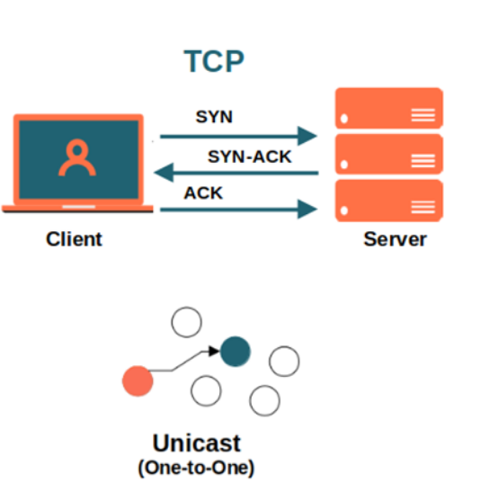
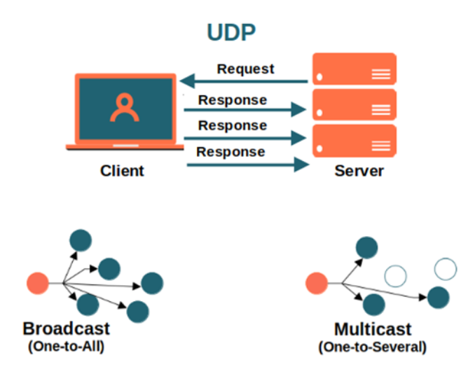

# Parte I

1. [Protocolos de rede](#1-protocolos-de-rede)
2. [Modelo OSI e TCP/IP](./2.modelosOSI.md)

## 1. Protocolos de rede

```aside
Protocolos de Rede (TCP, UDP, RTP, DCCP, SCTP, SSH, NNTP etc);
```

- [O que são procotocolos de rede e para que servem?](#o-que-são-procotocolos-de-rede-e-para-que-servem)
- [Tipos de protocolos de rede](#tipos-de-protocolos-de-rede)
- [1. IP](#1-ip)
- [2. TCP e UDP](#2-tcp-e-udp)

### O que são procotocolos de rede e para que servem?

Protocolos de rede são os conjuntos de normas que permitem que duas ou mais máquinas conectadas à internet se comuniquem entre si. Funciona como uma linguagem universal, que pode ser interpretada por computadores de qualquer fabricante, por meio de qualquer sistema operacional.

Eles são responsáveis por pegar os dados transmitidos pela rede e dividi-los em pequenos pedaços, que são chamados de pacotes. Cada pacote carrega em si informações de endereçamento de origem e destino. Os protocolos também são responsáveis pela sistematização das fases de estabelecimento, controle, tráfego e encerramento.

Existem três elementos-chave que definem os protocolos de rede. São eles:

    sintaxe: representa o formato dos dados e a ordem pela qual eles são apresentados;
    semântica: refere-se ao significado de cada conjunto sintático que dá sentido à mensagem enviada;
    timing: define uma velocidade aceitável de transmissão dos pacotes.

Fonte/Citação: [opservices](https://www.opservices.com.br/protocolos-de-rede/)

### Tipos de protocolos de rede

Os tipos de protocolos de rede são divididos de acordo com a sua natureza do serviço disponibilizado. E também em qual camada de profundidade estão localizados na rede de internet.

Essas camadas, junto com alguns exemplos de protocolos, são:

- **Camada de Aplicação**: Usada pelos programas para enviar e receber dados de outros programas pela própria internet.
  - WWW (navegação web), HTTP, SMPT (emails), FTP (transferência de arquivos) e SSH. 
- **Camada de Transporte**: Para transporte de arquivos recebidos da camada anterior. Aqui acontece a organização e a transformação deles em pacotes menores, que serão enviados à rede.
  - TCP, UDP e SCTP.
- **Camada de Rede**: Os arquivos empacotados na camada anterior são recebidos e anexados ao IP da máquina que envia e que recebe os dados. Daqui, são enviados pela internet usando a próxima camada.
  - IP (IPv4 e IPv6).
- **Camada de Estrutura Física**: É a camada que executa o recebimento ou envio de arquivos na web.
  - Ethernet e Modem.

Fonte/Citação: [weblink](https://www.weblink.com.br/blog/tecnologia/conheca-os-principais-protocolos-de-internet/)

### 1. IP

O protocolo IP, do termo em inglês Internet Protocol (Protocolo de Internet) faz parte da camada de internet e é um dos protocolos mais importantes da web. Ele permite a elaboração e transporte dos pacotes de dados, porém sem assegurar a sua entrega.

O destinatário da mensagem é determinado por meio dos campos de endereço **IP** (endereço do computador), **máscara de sub rede** (determina parte do endereço que se refere à rede) e o campo **gateway** estreita por padrão (permite saber qual o computador de destino, caso não esteja localizado na rede local).

#### 1.1 IP, máscara de sub rede e gateway

O endereço de IP, parece como o endereço da nossa casa.
Para recebemos coisas/pacotes dos correrios, precisamos informar o endereço da nossa casa.

E o IP precisa identificar o dispositivo para enviar e mandar coisas/pacotes.
Justamente pq o IP é um procolo usado para identificar dispositivos e conexões.

Descobrindo endereço de IP

```bash
#para linux:
$ ifconfig 
# ipconfig para windows
```

Como você já deve saber, o **IP é o endereço do dispositivo na web**. Explicando-o didaticamente, trata-se de uma sequência numérica que rotula o computador, permitindo a sua identificação quando está online.

Já a **máscara de rede** é utilizada para definir a quantidade de endereços IP pertencentes à rede, concedendo um IP único a cada dispositivo integrado a ela, dividindo-os em sub-redes.

E o gateway é o roteador/model/wifi. A saída p internet.

Gateway, vem do inglês e significa “portão de entrada”. Uma definição que deixa muito claro o seu propósito: servir como um elo entre dois pontos. Sendo assim, é possível notar que usamos o gateway o tempo todo quando nos conectamos à internet.

Pense nisso: em sua casa, para se conectar à rede, você precisa de um dispositivo como um smartphone ou um notebook. Porém, não basta apenas ligar o aparelho, você precisa conectá-lo a um roteador Wi-Fi, via cabo ou pelas redes móveis, pois só assim poderá começar a navegar e adquirir informações.

Essas três opções(wifi, cabo e rede móveis) funcionam como o portão principal que vai permitir que todos os dados (de ambos os lados) atravessem para alcançar seus destinos.

Fonte/Citação: [e-tinet](https://e-tinet.com/linux/ifconfig/) e [tecnoblog](https://tecnoblog.net/responde/o-que-e-gateway/)

#### 1.2 IP interno e IP externo

O IP local (ou IP interno) identifica cada dispositivo individualmente. Ou seja, é o endereço atribuído pelo roteador à sua máquina na rede local.

Já o IP externo é a identificação que o seu provedor de internet forneceu para sua residência ou empresa. É pelo IP externo que o seu dispositivo consegue se conectar à rede mundial.

A principal diferença entre endereços IP externos e internos é o alcance e a que estão conectados. Um endereço IP externo te identifica na Internet, para que todas as informações que procura possam chegar a você. Um endereço IP interno é usado em uma rede privada para se conectar com segurança a outros dispositivos nessa mesma rede.

Fonte/Citação: [avast](https://www.avast.com/pt-br/c-ip-address-public-vs-private)

**Exemplo**:


> Estou no meu notebook e quero me comunicar com o site www.google.com → O IP interno 192.168.0.109 do meu dispositivo envia a informação para o IP interno do roteador (gateway  192.168.0.1) → e o IP interno 192.168.0.1 envia para rede externa 216.58.192.5 → que faz a comunicação com a internet.

#### O que podemos descobrir com o IP?

- O sistema do roteador
- Quais portas estão abertas (port scan - NMAP)
- Servidor exposto

Mas você pode reiniciar o roteador/modem ou entrar em contato com o provedor de internet para mudar o IP.

#### 1.3 IPv4 e IPv6

Já pensou no caos que seria o serviço de correios se houvesse um limite para designar endereços no mundo? Novas casas começam a surgir, mas não temos como identificá-las, porque as opções de endereços acabaram! Foi mais ou menos isso que aconteceu com os endereços das máquinas que acessam a internet.

O que acontece é que o Protocolo de Internet definido na década de 80, lá no início da internet, também conhecido como IPv4, tem um limite de combinações de endereços de 4 bilhões. Claro que na época em que foi criado não se imaginaria que algum dia essa quantidade seria insuficiente para atender a todos, mas à medida que a internet foi se popularizando e outros dispositivos como os smartphones começaram a surgir, foi preciso pensar em algumas soluções para o problema do esgotamento de endereços IP.

**O que é IPv4 e IPv6?**

- **IPv4** (Internet Protocol versão 4) é o formato de endereço padrão que permite que todos os computadores na internet se comuniquem entre si. O IPv4 é escrito como uma sequência de dígitos de 32 bits e um endereço IPv4 é composto por quatro números, cada um entre 0 e 255, separados por pontos.

O IPv4 permite mais de 4 bilhões de endereços diferentes e tem nos atendido bem por décadas.

> exemplo de IPv4: 168.213.226.204

- **IPv6** (Internet Protocol versão 6) é um padrão atualizado para identificar computadores na Internet. Como o IPv4, ele oferece um identificador exclusivo a cada dispositivo, que foi ajustado para acomodar o número crescente de computadores conectados à internet.

O IPv6 aumenta o número de endereços IP possíveis de 4 bilhões de IPv4 para 340 trilhões de trilhões de trilhões. O IPv6 é escrito como uma string hexadecimal de dígitos de 128 bits e um endereço IPv6 típico se parece com isto:

> 2001:0ab8:85a2:0000:0000:8a3e:0370:7334

**As principais diferenças entre o protocolo IPv4 e IPv6**

- A principal diferença entre o protocolo IPv4 e o protocolo IPv6 é a capacidade de expansão que cada um apresenta. Como vimos anteriormente, o IPv6 possibilita a criação de muito mais endereços do que seu antecessor; cerca de 79 octilhões a mais, para ser mais específico. O que é o mesmo que 56 octilhões de endereços por ser humano na terra.

- O IPv6 também acabou com um dos maiores vilões do IPv4: o broadcast. Na nova versão, são utilizados apenas unicast e multicast, e houve a introdução do anycast, um tipo de endereço configurado em múltiplas interfaces.

```bash
- Unicast: Comunicação um para um.
- Multicast: Comunicação um para muitos (grupo de dispositivos configurados com o mesmo endereço).
- Anycast: Endereço configurado em múltiplas interfaces.
```

- Além disso, no protocolo IPv6 não se usa mais o termo “máscara”, e sim “prefixo”, mudando a forma de endereçamento. Ele ainda mantém a parte de rede, sub rede e host, como no protocolo IPv4, mas há essa diferença.

- Por fim, o IPv6 também difere do seu precursor na parte do cabeçalho ou header. Nele, tudo foi simplificado e houve a introdução dos chamados “cabeçalhos de extensão”, além do suporte nativo a questões importantes como segurança e QoS. Assim, podemos concluir que o protocolo IPv6 é uma versão muito mais eficiente, segura e útil que o IPv4.

|         | IPv4   |  IPv6  |
----------|--------|---------|
| Tamanho do endereço | 32-bits(0-255)   | 128-bits(16 octetos) |
| Notação | Decimal com ponto | Hexadecimal alfanúmerica |
| Exemplo | 168.213.226.204 | 2001:0ab8:85a2:0000:0000:8a3e:0370:7334 |
| Como obter o IP | DHCP ou configuração manual | Compatível com configuração automática |

**Segurança**

- Ipv6 criptografia de ponta a ponta, tornando o ataque man-in-the-middle(MITM) mais difícil.
- IPSec nativo(mas o usuário precisa ativar). Existe no IPv4, mas precisa ser configurado pelo provedor de internet.
  - IPSec fornece recursos de criptografia de pacotes de dados, de forma a garantir três aspectos destes: integridade, confidencialidade e autenticidade.

**IPv6 é mais/menos seguro que IPv4?**

Comparar a segurança do IPv4 com a segurança do IPv6 não faz sentido. Ambos tem as suas vulnerabilidades.

É essencial lembrar que muitos ataques acontecem acima da camada de rede(modelo TCP/IP). Um e- mail de phishing associado a ransomware, por exemplo, representa a mesma ameaça, seja entregue por um link IPv4 ou IPv6.

Ou seja, não é limitação de tecnologia e sim grande parte dos ataques se reume ao fator humano.

A coisa mais importante que você pode fazer para aumentar a segurança IPv6 da sua organização é aprender o protocolo, como ele funciona e como ele é implementado em diferentes sistemas.

Fontes: [avg](https://www.avg.com/pt/signal/ipv4-vs-ipv6), [hostone](https://blog.hostone.com.br/protocolo-ipv4-ipv6/), [eletronet](https://www.eletronet.com/blog/entenda-as-diferencas-entre-ipv4-e-ipv6/) e [dltec](http://www.dltec.com.br/blog/redes/diferencas-entre-ipv4-e-ipv6/)

### 2. TCP e UDP

TCP e UDP são protocolos que determinam como os dados são trocados pela Internet. Ambos construídos sobre o protocolo IP, eles compartilham muitas semelhanças, mas a diferença entre TCP e UDP os tornam adequados para finalidades diferentes. Eles são os dois protocolos mais amplamente usados com os quais os usuários da Internet e empresas interagem diariamente.

#### **TCP**

O protocolo de controle de transmissão (TCP) é orientado à conexão, o que significa que, uma vez que a conexão foi estabelecida, os dados podem ser transmitidos em duas direções. Ele tem sistemas integrados para verificar se há erros e garantir que os dados sejam entregues na ordem em que foram enviados, tornando-o o protocolo perfeito para a transferência de informações como imagens estáticas, arquivos de dados e páginas da web.

**Como funciona?**

Quando você solicita uma página da web em seu navegador, seu computador envia pacotes TCP para o endereço do servidor da web, solicitando que ele envie a página da web de volta para você. O servidor da web responde enviando um fluxo de pacotes TCP, que o seu navegador da web une para formar a página da web. Quando você clica em um link, entra, posta um comentário ou faz qualquer outra coisa, seu navegador da web envia pacotes TCP para o servidor e o servidor envia pacotes TCP de volta.

O TCP tem tudo a ver com confiabilidade — os pacotes enviados com TCP são rastreados para que nenhum dado seja perdido ou corrompido em trânsito. É por isso que os downloads de arquivos não são corrompidos, mesmo se houver problemas na rede. Claro, se o destinatário estiver offline, seu computador desistirá e você verá uma mensagem de erro dizendo que ele não pode se comunicar com o host remoto.



Handshake TCP de 3 tempos:

Handshal permite a uatenticação e o encerramento de uma conexão completa:

1. O  **cliente** **enviará** ao **servidor** uma solicitação "**SYN**", "pedindo" o estabelecimento de uma conexão.
2. Uma vez que o **servidor** tenha **processado** a resposta, uma resposta "**SYN-ACK**" será **enviada** de **volta** ao **cliente**, reconhecendo que foi recebida.
3. O **cliente responde** com um "**ACK**" e, uma vez recebido pelo servidor, a comunicação é estabelecida.

#### UDP

O User Datagram Protocol (UDP) é um protocolo de Internet mais simples e sem conexão, no qual os serviços de verificação e recuperação de erros não são necessários. Com o UDP, não há sobrecarga para abrir, manter ou encerrar uma conexão — os dados são continuamente enviados para o destinatário, quer ele os receba ou não.

No UPD temos:

- **Porta de origem**: Neste campo é armazenado qual a porta de origem do pacote o que permite receber uma resposta, como uma consulta DNS. Este campo possui 16 bits de tamanho.
- **Porta de destino**: Neste campo fica armazenado qual a porta o pacote será enviado assim que for entregue à máquina especifica. Quando for entregue, ele será tratado pela aplicação que estará funcionando na mesma. Este campo possui um tamanho de 16 bits.
- **Comprimento da mensagem**: Este é um campo que especifica o comprimento em bytes do cabeçalho UDP mais os dados carregados. O tamanho mínimo é de 8 bytes devido ao comprimento do cabeçalho. O tamanho máximo possível para um datagrama UDP é de 65.507 bytes (65.535 − 8 bytes do cabeçalho UDP − 20 bytes do cabeçalho IP), devido ao protocolo IPv4. Em IPv6 é possível termos pacotes de tamanho maior do que 65.535.
- **Checksum**: Pode ser usado para verificação de erros do cabeçalho e dos dados transmitidos. É opcional em IPv4 e mandatório em IPv6. Se não for usado, deverá ser preenchido com zeros.

>UDP simplesmente envia os pacotes. Não quer saber se foi recebido ou não.

**Como funciona?**

O protocolo UDP funciona de forma semelhante ao TCP, mas elimina todo o material de verificação de erros. Toda a comunicação de ida e volta introduz latência, tornando as coisas mais lentas.

Quando um aplicativo usa UDP, os pacotes são enviados apenas para o destinatário. O remetente não espera para ter certeza de que o destinatário recebeu o pacote. Se o destinatário perder alguns pacotes UDP aqui e ali, o remetente não os reenviará. Perder toda essa sobrecarga significa que os dispositivos podem se comunicar mais rapidamente.

UDP é usado quando a velocidade é desejável e a correção de erros não é necessária. Por exemplo, ele é frequentemente usado para transmissões ao vivo e jogos online. Digamos que você esteja assistindo a um stream de vídeo ao vivo, que geralmente é transmitido usando UDP em vez de TCP. O servidor apenas envia um fluxo constante de pacotes UDP para os computadores que estão assistindo.

Se você perder a conexão por alguns segundos, o vídeo pode congelar ou ficar trêmulo por um momento e, em seguida, pular para o trecho atual da transmissão. Se ocorrer uma pequena perda de pacote, o vídeo ou áudio pode ficar distorcido por um momento, pois o vídeo continua a ser reproduzido sem os dados ausentes.



#### Quando usar TCP ou UDP?

Os serviços que exigem que um cliente e um servidor enviem pacotes simultaneamente funcionam melhor com o TCP, pois ajuda a ativar a largura de banda total da rede. Use o TCP quando um pequeno atraso estiver bom e você precisar se concentrar na confiabilidade em vez da velocidade. Exemplos de aplicativos que usam TCP são o Instagram e a maioria dos serviços de e-mail . Serviços de vídeo como Netflix e YouTube também o utilizam para manter a integridade dos dados.

O UDP é melhor quando o cliente e o servidor enviam pacotes independentemente e os aplicativos são sensíveis ao tempo. Como não há atrasos de retransmissão, funciona bem para (a maioria) jogos de RPG, bem como para serviços de DNS e VOIP como o Zoom, que exigem velocidades rápidas.

Alguns serviços combinam os dois protocolos para uma solução rápida e confiável. Por exemplo, o Skype usa TCP para sinalização e UDP/TCP para transporte de tráfego.

#### Resumo

| | |
---|---|
|TCP |TCP é um protocolo orientado à conexão e fornece a comunicação confiável com vários recursos.|
|UDP |UDP é um protocolo de transporte em tempo real sem conexão, que oferece um processo de comunicação mais rápido, mas com pouca confiabilidade|

| | TCP| UDP|
--|--|--|
|Conexão | Orientado à conexão — O dispositivo deve estabelecer uma conexão antes de transmitir dados e fechar a conexão após a transmissão(conecta - verifica se o destino tá online - envia os pacotes - termina de enviar os pacotes - finaliza a conexão).| Sem conexão(normalmente usado em transmissões de Broadcast)
|Confiabilidade |Confiável — A entrega do pacote de dados é garantida. TCP pode recuperar pacotes perdidos, eliminar pacotes duplicados, recuperar dados corrompidos e recuperar a ligação em caso de problemas no sistema e na rede| Não confiável, as mensagens enviadas podem não alcançar o destino.|
|Transmissão | Full duplex, é possível a transferência simultânea em ambas direções(cliente-servidor) durante toda a sessão, toda comunicação.|  broadcast e multicast|
|Tipo de informação de comunicação| Stateful — O cliente e o servidor mantem as informações sobre a sessão.| Stateless — O servidor não mantém nenhuma informação sobre a sessão. |
|Sequência | Todos os pacotes são encaminhados ao destinatário de forma ordenada, mas não significa que irá chegar de forma ordenada, por conta das rotas, latencia... O ponto final, precisa organizar todos esses pacotes.| Não há ordenação dos segmentos, se chegarem fora de ordem, não serão reordenados.|
|Fluxo| O receptor, a medida que recebe os dados, envia mensagens ACK, confima a recepção de um segmento, dado, como funcionalidade extra.| Não há confirmação de recpeção dos segmentos|
|Velocidade|O TCP é mais lento que o UDP porque realiza verificação de erros, gerenciamento de fluxo e garante a entrega de pacotes de dados.| O UDP é mais rápido que o TCP, pois não garante a entrega do pacote de dados.|
|Aplicação | Navegação na web. Transferência de arquivo. E-mail (SMTP, IMAP/POP)| VPN. Streaming de vídeo e música. Jogos online, jogos multiplayer. Transmissões ao vivo e videoconferência. Consultas de sistema de nome de domínio (DNS). Voz sobre IP (VoIP).|

Fonte: [gaea](https://gaea.com.br/diferenca-entre-tcp-e-udp/), [privateinternetaccess](https://www.privateinternetaccess.com/blog/tcp-vs-udp-understanding-the-difference/)
