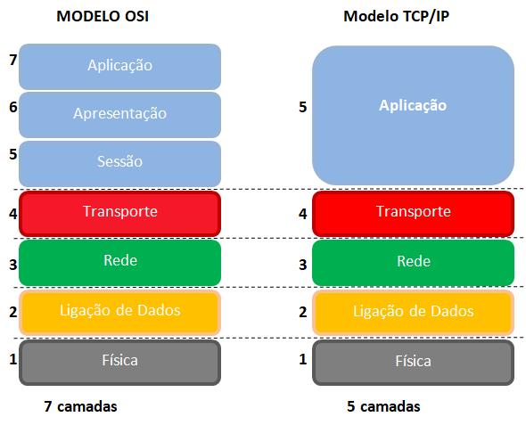
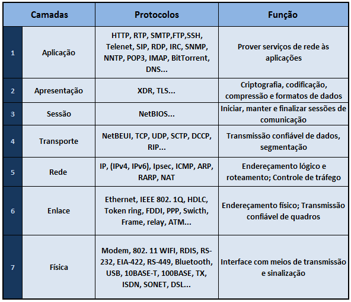
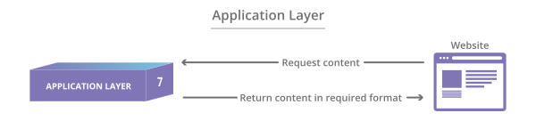
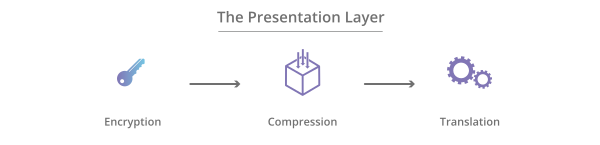
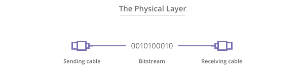
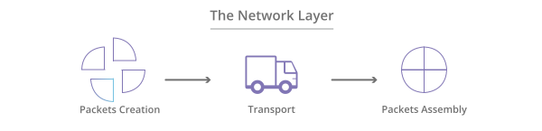
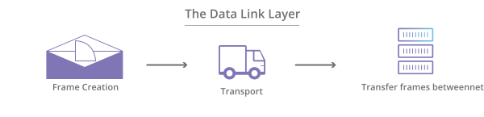
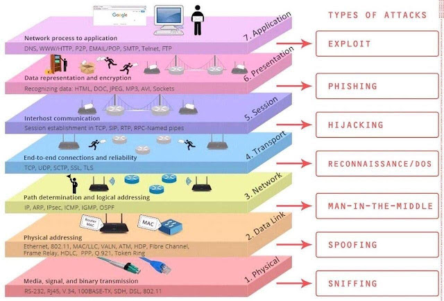

👾 [Inicio](https://rayanepimentel.github.io/InfoSec-iniciante/) | [Cronograma](https://rayanepimentel.github.io/InfoSec-iniciante/cronograma/) | [Bash e Redes](https://rayanepimentel.github.io/InfoSec-iniciante/cronograma/bashRedes) | [Redes](https://rayanepimentel.github.io/InfoSec-iniciante/redes/redes-iniciante/start.html) | [Rede parte I ](https://rayanepimentel.github.io/InfoSec-iniciante/redes/redes-iniciante/parte1/menu.html)

# Parte I

## 2. Modelo OSI e TC/IP

O TCP/IP, trata-se do acrônimo dos protocolos TCP (Transmission Control Protocol) e IP (Internet Protocol), e são os responsáveis pela base de envio e recebimento de dados por toda a internet. Essa pilha de protocolos é dividida em 5 camadas (em referência ao RFC1392, mas as vezes é dito 4 camadas):

- 5° Camada - Aplicação: Essa parte contém todos os protocolos para um serviço específico de comunicação de dados em um nível de processo-a-processo. Exemplo: HTTP, HTTPS, FTP, DNS.
- 4° Camada - Transporte: É esta camada que garante o envio e o recebimento dos pacotes vindos da camada 3. Ela gerencia o transporte dos pacotes para garantir o sucesso no envio e no recebimento de dados. Exemplo: TCP e UDP.
- 3° Camada - Rede (Internet): É nesta camada que temos o endereçamento IP de origem e de destino, ela também pode priorizar alguns pacotes e decidir qual caminho seguir para enviar seus dados. Exemplo: IP, ICMP, NAT.
- 2° Camada - Enlace (Ligação): Nesta camada, os dados recebidos do meio físico são verificados para ver se possuem algum erro e,se possuírem, esse erro pode ser corrigido. Dessa forma, as camadas superiores podem assumir uma transmissão praticamente sem erros. Nesta camada também encontra-se o Endereço MAC. Exemplo: Ethernet, Wi-Fi.
- 1° Camada - Física: Nesta camada são especificados os dispositivos, como hubs e os meios de transmissão, como os cabos de rede. Os dados são transmitidos por esses meios e processados na segunda camada. (editado)

Já o modelo OSI é bastante similar, com a diferença de que a Camada de Aplicação é dividida em 3 partes: **Aplicação, Apresentação e Sessão**.

### Modelo OSI

Modelo OSI é mais uma demostração acadêmica, didivida em 7 camadas.

A informação sai da 7ª camada, desce até a 1ª camada. Chegando no seu destino ela soube da 1ª camada até a 7ª camada, para ser visivel pro usuário final.

#### 7. Camada de aplicação

**Essa é a única camada que interage diretamente com os dados do usuário**. Os softwares aplicativos, como navegadores web e clientes de e-mail, dependem da camada de aplicação para iniciar as comunicações. Mas é preciso deixar claro que os softwares aplicativos clientes não fazem parte da camada de aplicação, que, na verdade, é responsável pelos protocolos e manipulação de dados dos quais o software depende para apresentar dados significativos ao usuário. Os protocolos da camada de aplicação incluem o HTTP e o SMTP (Simple Mail Transfer Protocol, um dos protocolos que permite a comunicação por e-mail).

É a camada que o usuário consegue visualizar no computador dele(transfêrencia de arquivos, terminal virtual, e-mail...)

#### 6. Camada de apresentação

Essa camada é a principal responsável pela preparação dos dados para que possam ser usados pela camada de aplicação; em outras palavras, a camada 6 torna os dados apresentáveis para que os aplicativos os consumam. **A camada de apresentação é responsável pela tradução, criptografia e compactação dos dados**.

Dois dispositivos de comunicação que se comunicam podem usar métodos de codificação diferentes; por isso, a camada 6 é responsável pela tradução dos dados de entrada em uma sintaxe que a camada de aplicação do dispositivo receptor possa entender.

Tradução de todas as informações para que ela seja compreendida.

#### 5. Camada de sessão

**Essa é a camada responsável pela abertura e fechamento da comunicação entre os dois dispositivos**. O tempo decorrido entre o momento em que a comunicação é aberta e fechada é conhecido como "sessão". A camada de sessão garante que a sessão permaneça aberta pelo tempo necessário para transferir todos os dados que estão sendo trocados e, em seguida, fecha imediatamente a sessão para evitar o desperdício de recursos.

A camada sessão também lida com funções de autenticação e autorização. Verificando também a entrega dos dados.

Iniciar, manter e finalizar uma sessão de comunicação. Ex: fechar um site.

#### 4. Camada de transporte

**A camada 4 é responsável pela comunicação de ponta a ponta entre os dois dispositivos. Isso inclui pegar os dados da camada de sessão e dividi-los em porções chamadas segmentos antes de enviá-los para a camada 3**. A camada de transporte no dispositivo receptor é responsável por remontar os segmentos em dados que a camada de sessão possa consumir.

#### 3. Camada de Rede

**A camada de rede é responsável por facilitar a transferência de dados entre duas redes diferentes**. Se os dois dispositivos que estão se comunicando estiverem na mesma rede, a camada de rede será desnecessária. A camada de rede divide os segmentos da camada de transporte em unidades menores denominadas pacotes no dispositivo remetente e remonta esses pacotes no dispositivo receptor. A camada de rede também encontra o melhor caminho físico para que os dados cheguem ao seu destino, o que é conhecido como "roteamento".

Ojetivo: endereçamento lógico, roteamento e controle de trafégo por meio do IP(IPV4, IPV6), Ipsec, ICMP, ARP, RARP e NAT.

#### 2. Camada de enlace de dados

**A camada de enlace de dados é muito semelhante à camada de rede, a não ser pelo fato de que a camada de enlace de dados facilita a transferência de dados entre dois dispositivos na MESMA rede**. A camada de enlace de dados pega os pacotes da camada de rede e os divide em pedaços menores denominados "quadros". Como a camada de rede, a camada de enlace de dados também é responsável pelo controle de fluxo e pelo controle de erros na comunicação intrarrede (a camada de transporte faz o controle de fluxo e o controle de erros para comunicações inter-rede).

#### 1. Camada física

**Essa camada inclui o equipamento físico envolvido na transferência de dados, como cabos e comutadores**. Essa também é a camada em que os dados são convertidos em um fluxo de bits, que é uma sequência de 1s e 0s. A camada física de ambos os dispositivos também precisa aceitar de comum acordo uma convenção de sinal para que se possa distinguir os 1s dos 0s em ambos os dispositivos.

Fonte: [cloudflare](https://www.cloudflare.com/pt-br/learning/ddos/glossary/open-systems-interconnection-model-osi/)

<!-- ### [Analogia modelo OSI → Enviando e-mail](2.1analogiaOSI.md) -->

### Tipos de ataques em cada nível do modelo OSI

- Na camada física, é comum a utilização de um sniffer (wireshark) que nos permite ler os dados em modo bruto que circulam pela placa de rede.
- Para atacar a camada de enlace, é utilizada a técnica de spoofing (roubo de identidade) na qual o invasor modifica o MAC da placa de rede para substituí-lo pelo do computador vítima.
- A técnica Man in the middle modifica a tabela arp para que as solicitações entre o computador da vítima e seu roteador passem pelo computador do invasor.
- Usando a técnica do DOS, o invasor envia solicitações de conexão ao servidor para bloqueá-lo.
- O hijacking(sequestro) é usado para representar uma conexão TCP/IP, obtendo acesso não autorizado a informações por meio do sequestro do token de conexão.
- Phishing é a representação de uma página da Web real que o invasor usa para obter o login e a senha do usuário.
- Exploit é um programa executado no PC da vítima e usado para tirar proveito de uma vulnerabilidade no PC para obter acesso a um recurso ou obter privilégios de administrador.

Fonte: [delphimagic](https://delphimagic.blogspot.com/2019/08/tipos-de-ataques-en-cada-nivel-del.html)

 

 

[< Anterior](https://rayanepimentel.github.io/InfoSec-iniciante/redes/redes-iniciante/parte1/1.protocolosDeRede.html) | [Próxima >](https://rayanepimentel.github.io/InfoSec-iniciante/redes/redes-iniciante/parte1/2.1analogiaOSI.html)