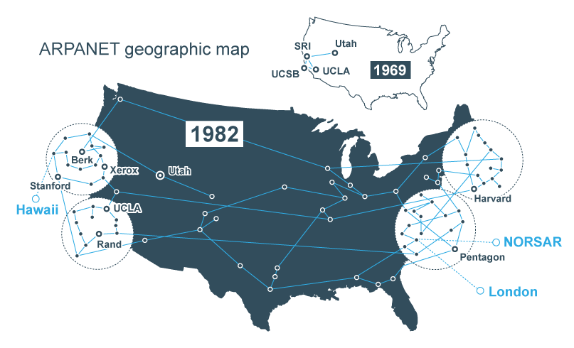

👾 [Inicio](https://rayanepimentel.github.io/InfoSec-iniciante/) | [Cronograma](https://rayanepimentel.github.io/InfoSec-iniciante/cronograma/) | [Bash e Redes](https://rayanepimentel.github.io/InfoSec-iniciante/cronograma/bashRedes) | [Redes](https://rayanepimentel.github.io/InfoSec-iniciante/redes/redes-iniciante/start.html)| [Rede parte I ](https://rayanepimentel.github.io/InfoSec-iniciante/redes/redes-iniciante/parte1/menu.html)

# Aspectos Históricos

## → Primeiros computadores

## → ARPANET

Você sabe o que é ARPANET? 

A `Advanced Research Projects Agency Network` (ARPANET) é uma rede de computadores considerada a base da internet, criada pela ARPA `Advanced Research Projects Agency`

- Inicialmente em 1969, a ARPANET foi conectada a 4 redes universitária nos EUA, permitindo cientista a compartilharem informações e recurso. 
    - Universidade da Califórnia em Los Angeles
    - Stanford Research Institute
    - Universidade da Califórnia em Santa Bárbara 
    - Universidade de Utah

