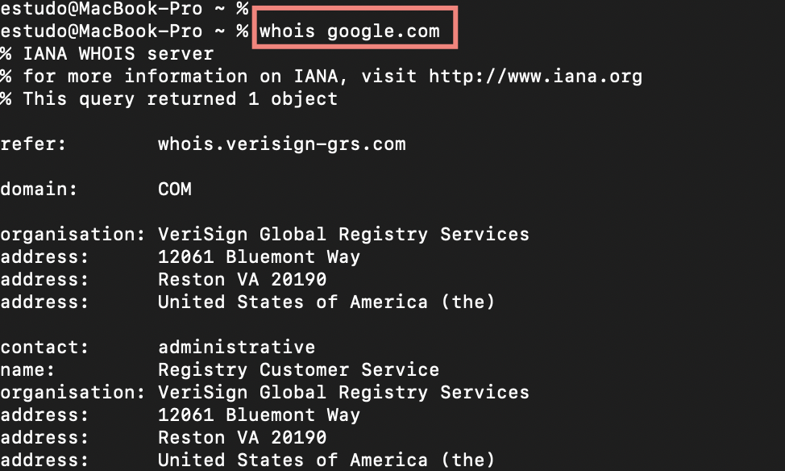
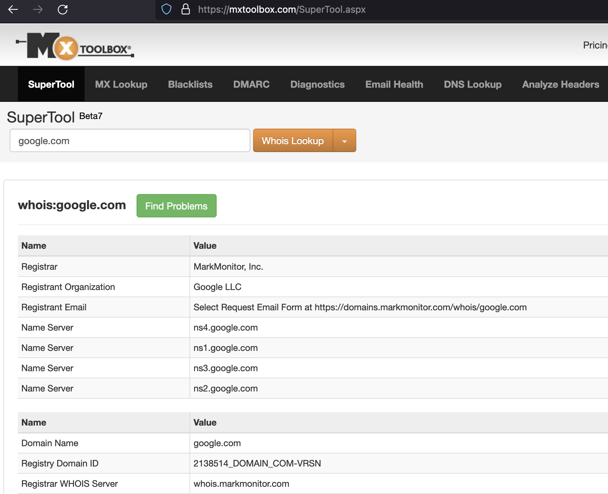

# Passive Reconnaissance

Learn about the essential tools for passive reconnaissance, such as <code>whois</code>, <code>nslookup</code>, and <code>dig</code>.

Link da sala: https://tryhackme.com/room/passiverecon

Sumário

- [1. Passive vc ative](#passive-vs-ative)
    - [Passive](#passive)
    - [Ative](#ative)
    - [Diferenças](#diferenças)
- [2. Whois](#whois)

## Passive vs ative

**Reconnaissance(recon)** é o processo de aquisição de informações sobre um alvo. Esse alvo  pode ser um computador, uma rede ou uma futura vítima de um  [ataque](https://www.codecademy.com/resources/docs/general/cyberattack) de engenharia social. O reconhecimento pode ser passivo ou ativo, dependendo de como ele adquire informações.

### Passive

A coleta passiva de informações usa fontes públicas que possuem informações sobre esse alvo. O uso de recursos públicos para coletar informações é OSINT.  Usando o OSINT, você pode coletar coisas como endereços IP, nomes de domínio, endereços de e-mail, nomes, nomes de host, registros de DNS e até mesmo qual software está sendo executado em um site e seus [CVEs associados](https://www.redhat.com/pt-br/topics/security/what-is-cve), sem infringir as leia. São dados publicos, que estão disponiveis e podem serem acessados por qualquer pessoa.

Atividades como:

    Procurar registros DNS de um domínio de um servidor DNS público.
    Verificar anúncios de emprego relacionados ao site de destino.
    Ler notícias sobre a empresa-alvo.

### Ative

O reconhecimento ativo  envolve interagir ativamente com o alvo.

→ O **objetivo** é coletar informações sobre aquele dispositivo ou outros dispositivos que estejam conectados a ele na mesma rede.

→ O reconhecimento ativo pode ser usado para **descobrir** informações como portas abertas/fechadas, o sistema operacional de uma máquina, os serviços em execução, captura de banner, descoberta de novos hosts ou localização de aplicativos vulneráveis em um host.

Atividades:

    Conectando-se a um dos servidores da empresa, como HTTP, FTP e SMTP.
    Chamar a empresa na tentativa de obter informações (engenharia social).
    Entrar nas instalações da empresa fingindo ser um reparador.

### Diferenças

A principal diferença entre reconhecimento ativo e passivo são os métodos que eles usam para coletar informações.  

As ferramentas de reconhecimento ativo interagem diretamente com os sistemas para coletar informações no nível do sistema, enquanto as ferramentas de reconhecimento passivo dependem de informações disponíveis publicamente.  

## Whois

### → O que é

WHOIS é um protocolo usado para consultar os bancos de dados que armazenam as informações sobre quem são os proprietários ou registrantes de um domínio. Tecnicamente, ele é considerado um protocolo de controle de transmissão (Transmission Control Protocol ou TCP) e um local público no qual você pode descobrir quem possui um determinado domínio. [Fonte](https://www.hostgator.com.br/blog/o-que-e-whois/)

### → Para que serve

O objetivo disso é ter um registro de quem possui cada site existente na internet. Dessa forma, se houver algo publicado em um site que viole a lei, há uma maneira de localizar o proprietário do site. [Fonte](https://www.hostgator.com.br/blog/o-que-e-whois/)

### → Como usar

<!-- Sintaxe

      whois [-h HOST ] [-p PORT ] [-aCFHlLMmrRSVx] [-g FONTE : PRIMEIRO ÚLTIMO ]Objeto 
      [-i ATTR ] [-S SOURCE ] [-T TYPE ]

      whois -t TIPO

      whois -v TIPO

      whois -q [version|sources|types] 

Opções:

    -h HOST	conecta no servidor HOST .
    -p PORT	conecta na PORT.
    –verbose mostra o que está acontecendo.
    -help exibe uma mensagem de ajuda e sai. -->

Você pode usar via terminal: `whois dominio|subdomino|ip` 

Ou por algum site, como https://mxtoolbox.com/SuperTool.aspx escolhendo a opção `Whois`

 