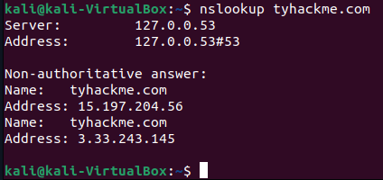
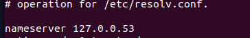
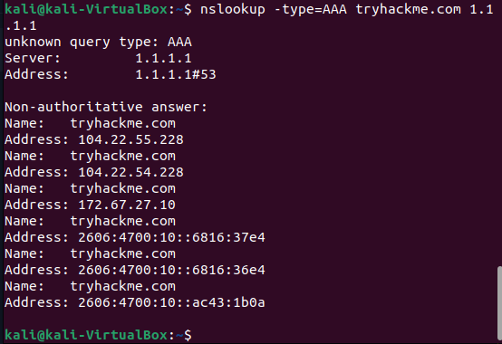
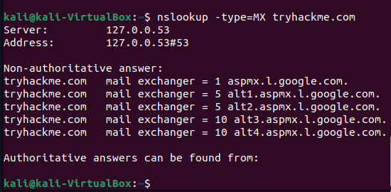
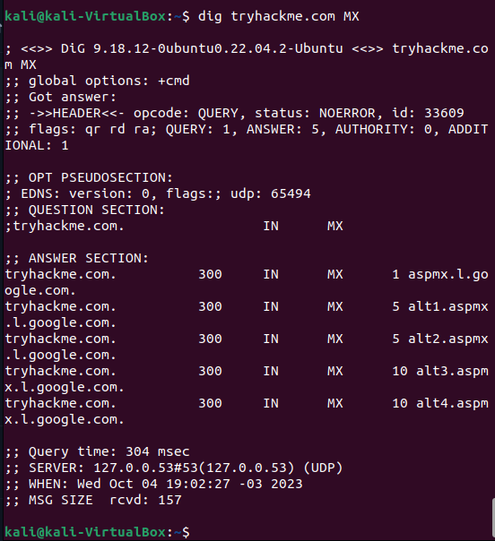
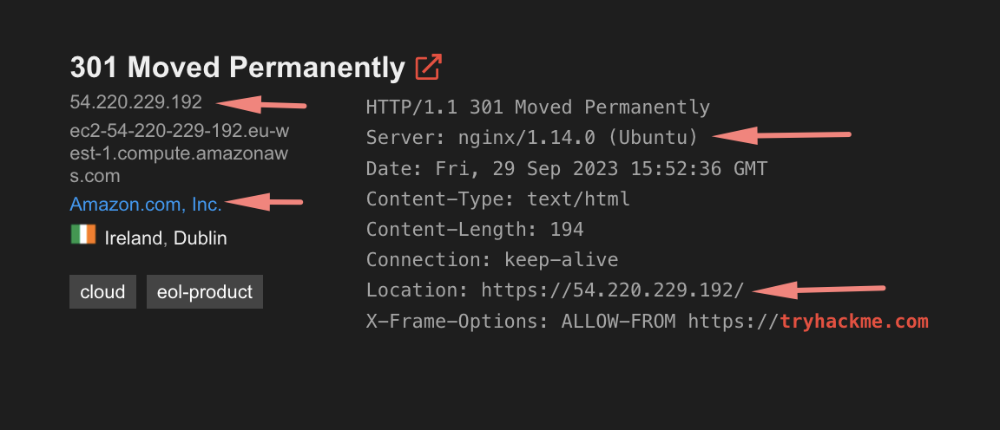

# Passive Reconnaissance


Learn about the essential tools for passive reconnaissance, such as <code>whois</code>, <code>nslookup</code>, and <code>dig</code>.


Link da sala: https://tryhackme.com/room/passiverecon

Sumário

- [1. whois](#whois)
- [2. nslookup e dig](#nslookup-e-dig)
- [3. DNSDumpster](#dnsdumpster)
- [4. Shodan](#shodanio)


## Whois

### → O que é

WHOIS é um protocolo usado para consultar os bancos de dados que armazenam as informações sobre quem são os proprietários ou registrantes de um domínio. Tecnicamente, ele é considerado um protocolo de controle de transmissão (Transmission Control Protocol ou TCP) e um local público no qual você pode descobrir quem possui um determinado domínio. [Fonte](https://www.hostgator.com.br/blog/o-que-e-whois/)

### → Para que serve

O objetivo disso é ter um registro de quem possui cada site existente na internet. Dessa forma, se houver algo publicado em um site que viole a lei, há uma maneira de localizar o proprietário do site. [Fonte](https://www.hostgator.com.br/blog/o-que-e-whois/)

Usamos o protocolo `WHOIS` para obter diversas informações sobre um domínio especifico.

### → Como usar

<!-- Sintaxe

      whois [-h HOST ] [-p PORT ] [-aCFHlLMmrRSVx] [-g FONTE : PRIMEIRO ÚLTIMO ]Objeto 
      [-i ATTR ] [-S SOURCE ] [-T TYPE ]

      whois -t TIPO

      whois -v TIPO

      whois -q [version|sources|types] 

Opções:

    -h HOST	conecta no servidor HOST .
    -p PORT	conecta na PORT.
    –verbose mostra o que está acontecendo.
    -help exibe uma mensagem de ajuda e sai. -->

Você pode usar via terminal: `whois dominio|subdomino|ip` 


Ou por algum site, como https://mxtoolbox.com/SuperTool.aspx escolhendo a opção `Whois`

 

## nslookup e dig

### nslookup

Usamos o `nslookup` para consultar o DNS e obter mapeamentos de nomes de domínio ou endereços IP, ou outros registros DNS. O objetivo é esse, recuperar informações sobre o domínio especificado e solucionar problemas relacionados ao DNS. 

`Como usar`:

```bash
# no terminal digite
nslookup dominio
```



Aqui temos uma visão geral da infraestrutura de DNS do domínio.


1. Informacões do servidor DNS local na minha rede, que foi utilizado para obter as informações. Esse servidor de DNS especifico, tá disponivel em  `/etc/resolv.conf`

2. `Non-authoritative answer`: Isto significa que o nameserver local não é autoridade sobre o nome de domínio especificado. Que as informações fornecidas não são da fonte autoritativa para o domínio, a resposta veio de um armazenado de cache, que foi obtida de um servidor autoritativo em uma consulta anterior.
3. `Name` é o host
4. `Address` valor tipo A (endereço IP) para o domínio especificado.

Vimos que o tryhack tem dois endereços de IP associados a ele, isso é chamado de [DNS Round Robin](https://www.cloudflare.com/pt-br/learning/dns/glossary/round-robin-dns/).


Temos outra forma de usar o nslookup

> nslookup OPTIONS DOMAIN_NAME SERVER


    `OPTIONS`: São as opções que você pode usar com o comando nslookup para personalizar a consulta.

    `DOMAIN_NAME`: É o nome de domínio que você deseja pesquisar.

    `SERVER`: É o servidor DNS que você deseja usar para a consulta. Se você não especificar um servidor, o comando nslookup usará o servidor DNS padrão 


| Tipo de consulta | Resultado            |
|------------------|----------------------|
| A                | Endereços IPv4      |
| AAAA             | Endereços IPv6      |
| CNAME            | Nome Canônico        |
| MX               | Servidores de e-mail|
| SOA              | Start of Authority|
| TXT              | Registros TXT        |


| DNS Provider  | Primary DNS   | Secondary DNS    |
|---------------|---------------|------------------|
| Cloudflare    | 1.1.1.1       | 1.0.0.1          |
| Google        | 8.8.8.8       | 8.8.4.4          |
| Quad9         | 9.9.9.9       | 149.112.112.112  |

Ex: retornar todos endereços de IPv6 no DNS primario do Cloudflare

```bash
nslookup -type=AAA tryhackme.com 1.1.1.1
# ou
nslookup -type=aaa tryhackme.com 1.1.1.1
```


Verificar servidores de e-mail:



```
Essas informações são usadas para entregar emails para o domínio tryhackme.com. Quando um servidor de email envia um email para tryhackme.com, ele consulta os registros MX para determinar para qual servidor de email entregar o email.
``` 

Um comando interessante também é o `debug`.  No modo de depuração, o nslookup exibirá informações adicionais que podem ser úteis para solução de problemas, como os detalhes da consulta DNS e os registros retornados pelo servidor DNS


#### dig

O `dig` é bem parecido com o `nslookup` oferece uma saída mais detalhada e mais opções de consulta, enquanto `nslookup` oferece uma saída mais simples e menos opções de consulta. Ou seja, o `dig` tem mais funcionalidades

```bash
# sitaxe
dig [server] [name] [type]
```

- [server] – o endereço do IP ou hostname do servidor a ser consultado. Se você não especificar, será o servidor listado em `/etc/resolv.conf`.
- [name] - o nome do registro de recurso que deve ser pesquisado.
- [type] - o tipo de pesquisa solicitada pelo dig. Exemplo: A, AAA, SOA, MX, TXT. Por padrão será o A.

Exemplo:
```bash 
dig tryhackme.com MX
```



Mais `type`:

- `+short` - para obter respostas mais curtas
- `+noall +answer` - para respostas detalhadas
- `ANY` - consulta todos os tipos de registro DNS
- [Veja mais aqui](https://www.hostinger.com.br/tutoriais/como-usar-comando-dig-no-linux)

## DNSDumpster 

DNSDumpster é uma ferramenta de varredura de domínio para encontrar informações relacionadas ao host.

O DNSDumpster fornece informações como:

- subdomínio
- servidor DNS
- registro MX
- registro TXT
- mapeamento

Para acessar é super simples, basta navegar para endereço [https://dnsdumpster.com/](https://dnsdumpster.com/) e digitar o o dominio no campo de pesquisa.

Eu particularmente adorei essa ferramenta, o mapeamento é incrível. você tem uma visão bem clara das informações.


## Shodan.io 

Na fase do reconhecimento passivo, o Shodan pode ser muito util. O Shodan pode ser considerado um dos buscadores mais poderosos da internet. 

O Shodan asculha a internet e procura dispositivos conectados a rede, permitindo encontrar webcams, roteadores domésticos e empresariais, smartphones, tablets, servidores, computadores e etc. 

Ao obter uma resposta, o Shodan coleta todas as informações relacionadas ao serviço e as salva no banco de dados para torná-las pesquisáveis.

Ao pesquisar `tryhackme` no shodan, encontramos informações como:



Para saber mais como pesquisar, usar o shodan, aqui tem uma sala: https://tryhackme.com/room/shodan
